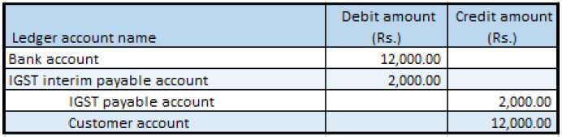

# Advance payment that has tax

1. Click **Accounts receivable > Payments > Payment journal**.
2. Create a record.
3. In the **Name** field, select a value.
4. On the **Setup** tab, select the **Amounts include sales tax** check box.
5. Click **Lines**.
6. Create a customer advance payment journal.
7. Save the record.
8. Click **Tax information**
9. On the **GST** tab, in the **HSN code** field, select a value
10. Click the **Customer tax information** tab
11. Click OK.

### Validate the tax details

12. Click **Tax document**.

Example:

- IGST: 20 percent

13. Click **Close**.
14. Click **Post > Post**.
15. Close the message.

### Validate the financial entries

16. Click **Inquiries > Voucher**.

