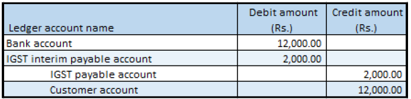

## Revised advance payment that has tax

1. Click **Accounts receivable > Payments > Payment journal**.
2. Create a record.
3. In the **Name** field, select a value.
4. On the **Setup** tab, select the **Amounts include sales tax** check box.
5. Click **Lines**.
6. Create a customer advance payment journal
7. Save the record
8. Click **Tax information**
9. On the **GST** tab, in the **HSN code** field, select a value
10. Click the **Customer tax information** tab
11. Click OK.
12. On the General tab, in the **Invoice type** field, select **Revised**.
13. In the **Original transaction id** field, select a value.
14. Verify that the Original transaction date field is automatically set, based on the original transaction ID that you selected.

### Validate the tax details

15. Click **Tax document**.

Example:

- IGST: 20 percent

16. Click Close.
17. Click **Post > Post**.
18. Close the message.

### Validate the financial entries

19. Click **Inquiries > Voucher**

