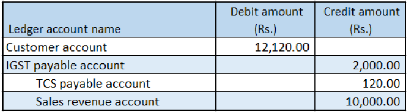

---
# required metadata

title: Tax Collected at Source that is calculated includes GST
description:  This topic includes information about Indis GST Whitepaper in Microsoft Dynamics 365 for Finance and Operations.
author: EricWang
manager: RichardLuan
ms.date: 06/04/2019
ms.topic: article
ms.prod: 
ms.service: dynamics-365-applications
ms.technology: 

# optional metadata

# ms.search.form: 
audience: Application User
# ms.devlang: 
ms.reviewer: 
ms.search.scope: Core, Operations
# ms.tgt_pltfrm: 
# ms.custom: 
ms.search.region: India
# ms.search.industry: 
ms.author: EricWang
ms.search.validFrom: 2019-06-01
ms.dyn365.ops.version: 10.0.4

---

# Tax Collected at Source that is calculated includes GST

### Withholding tax group form

1. Click **Tax > Indirect Tax > Withholding tax > Withholding tax groups**.
2. Select a withholding tax group.
3. On the **General** FastTab, in the **Include GST tax components for TDS or TCS calculation** field, select the required GST components.
4. Click Close

### Sales order form

5. Click **Accounts receivable > Sales orders > All sales orders**.
6. Create a sales order.
7. Click OK.

### Validate the tax details

8. On the Action Pane, on the **Purchase** tab, in the **Tax** group, click **Tax document** to review the calculated taxes.

Example:

- Taxable value: 10,000.00
- IGST: 20 percent

9. Click Close.
10. Click **Product and supply > Withholding tax**
11. Click Close.

### Post the purchase invoice

12. On the Action Pane, on the **Invoice** tab, in the **Generate** group, click **Invoice**.
13. Click OK.
14. Click OK.
15. On the Action Pane, on the **Invoice** tab, in the **Journals** group, click **Invoice**. Then, on the **Overview** tab, click **Voucher**.

