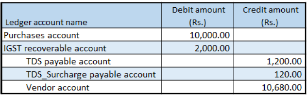

## Tax Deducted at Source that is calculated includes GST

### Withholding tax group form

1. Click **Tax > Indirect Tax > Withholding tax > Withholding tax groups**.
2. Select a withholding tax group.
3. On the **General** FastTab, in the **Include GST tax components for TDS or TCS calculation** field, select the required GST components
4. Click **Close**.

### Purchase order form

5. Click **Accounts payable > Purchase orders > All purchase orders**.
6. Create a purchase order
7. Click OK.

### Validate the tax details

8. On the Action Pane, on the **Purchase** tab, in the **Tax** group, click **Tax document** to review the calculated taxes.

Example:

- Taxable value: 10,000.00
- IGST: 20 percent

9. Click **Close**.
10. Click **Withholding tax**
11. Click **Close**.
12. Click **Confirm**.

### Post the purchase invoice

13. On the Action Pane, on the **Invoice** tab, in the **Generate** group, click **Invoice**.
14. In the **Default quantity for lines** field, select **Ordered quantity**.
15. Enter the invoice number.
16. On the Action Pane, on the **Vendor invoice** tab, in the **Actions** group, click **Post > Post**.
17. On the Action Pane, on the **Invoice** tab, in the **Journals** group, click **Invoice**. Then, on the **Overview** tab, click **Voucher**

