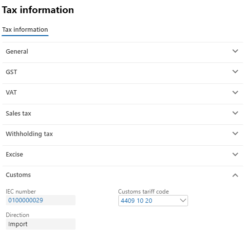
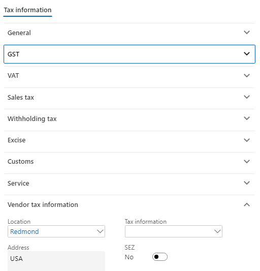
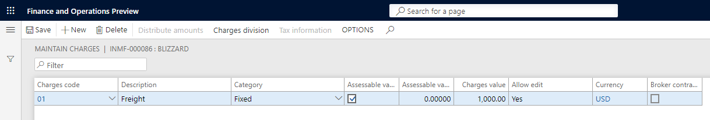
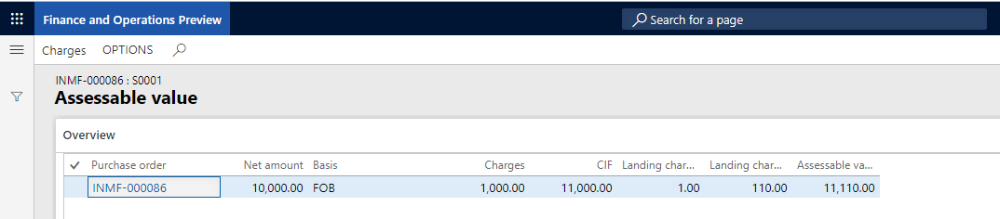

---
# required metadata

title: Indis GST Whitepaper
description:  This topic includes information about Indis GST Whitepaper in Microsoft Dynamics 365 for Finance and Operations.
author: EricWang
manager: RichardLuan
ms.date: 05/31/2019
ms.topic: article
ms.prod: 
ms.service: dynamics-365-applications
ms.technology: 

# optional metadata

# ms.search.form: 
audience: Application User
# ms.devlang: 
ms.reviewer: 
ms.search.scope: Core, Operations
# ms.tgt_pltfrm: 
# ms.custom: 
ms.search.region: India
# ms.search.industry: 
ms.author: EricWang
ms.search.validFrom: 2019-06-01
ms.dyn365.ops.version: 10.0.4

---

## Import of goods where there is GST

1. Click **Accounts payable > Purchase orders > All purchase orders**.

2. Create a purchase order for a foreign vendor account.

3. Save the record.

4. Click **Tax information**

   

5. Click the **GST** tab

6. Click the **Customs** tab

   

7. Click the **Vendor tax information** tab

   

8. Click OK.

9. Click **Functions > Maintain charges**.

10. Select a **charges code**.

11. Select the **Assessable value** check box.

12. In the **Charges value** field, enter a value.

13. Save the record.

    

14. Click Close

    

Note: The assessable value is calculated as Net amount + Misc. charges + 1% of Landing charges that are defined in Accounts payable parameters

### Validate the tax details

15. On the Action Pane, on the **Purchase** tab, in the **Tax** group, click **Tax document**.
16. On the **Tax details** FastTab, review the tax calculation.

Example:

- BCD: 10 percent
- LOI: 100 percent
- IGST: 20 percent
- Import exchange rate: 1 USD = 52 INR

Note: IGST can be calculated on Assessable value + BCD tax amount, by extending the configuration.

17. Click Close.
18. Click **Confirm**.

### Update the invoice registration

19. On the Action Pane, on the **Customs** tab, in the **Maintain** group, click **Invoice registration**.
20. In the **Import invoice number** field, select a value.
21. Click **Update**.

### Post the bill of entry

22. On the Action Pane, on the **Customs** tab, in the **Generate** group, click **Bill of entry**.
23. In the **Import invoice number** field, select a value.
24. In the **Bill of entry number** field, select a value.
25. Click the **Lines** tab.
26. In the **Quantity** field, enter a value.
27. Close the message.
28. Click **Tax document**
29. Click Close.
30. Click OK

### Post the product receipt

31. On the Action Pane, on the **Receive** tab, in the Generate group, click Product receipt.
32. In the **Quantity** field, select **Bill of entry quantity**.
33. Enter the **Product receipt**.
34. Click OK.

Sample Journal Entry for Import Purchase Order with GST

