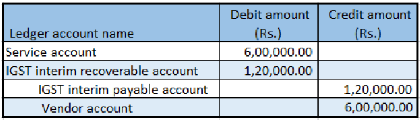

## Import of services where there is GST

1. Click **Accounts payable > Invoices > Invoice journal**.
2. Create a journal.
3. Click **Lines**.
4. Create a purchase of services for a foreign vendor
5. Save the record.
6. Click **Tax information**
7. On the **GST** tab, in the **SAC** field, select a value
8. Click the **Vendor tax information** tab
9. Click OK.

### Validate the tax details

10. Click **Tax document**.

Example:

- Taxable value: 20,000.00
- IGST: 20 percent
- Normal exchange rate: 1 USD = 60 INR

11. Click Close.
12. Click **Post > Post**.
13. Close the message.
14. Click **Inquiries > Voucher**

