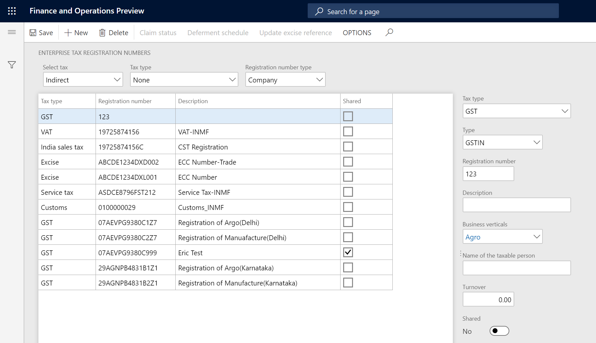
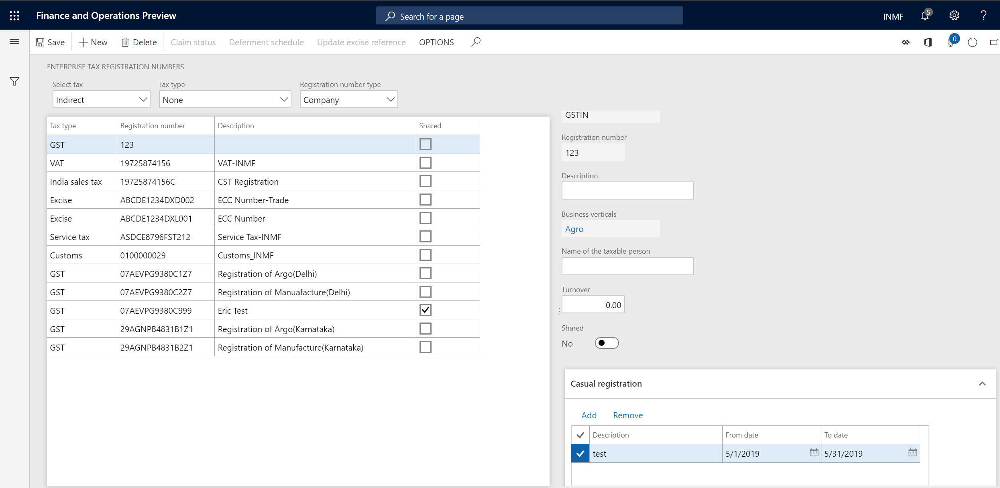
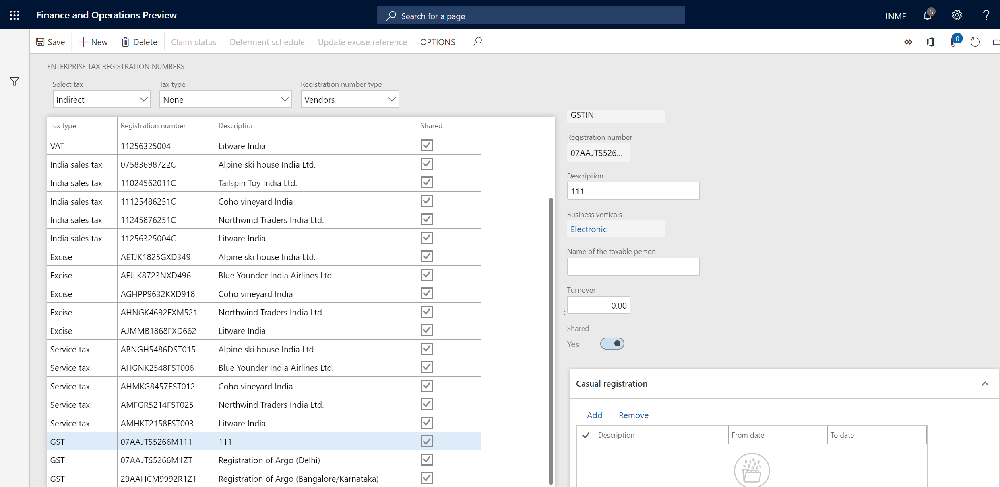
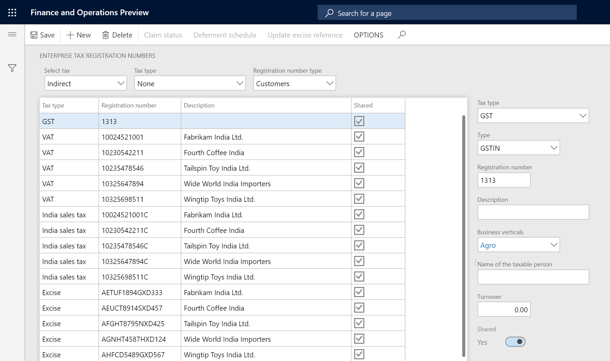

To enable India localization solution for GST in Dynamics 365 for finance and operation, below master data setup configurations are required:

- Define business vetical
- Update the state code and union territory
- Create a GSTIN master
- Define GSTIN numbers for the legal entity, warehouse, vendor, or customer masters
- HSN codes and Service accounting codes
- Create main accounts for the GST posting type
- Create a tax settlement period
- Attach the GSTIN to a tax registration group

This artical describes how to create a GSTIN master

## Create a GSTIN master

### Define company registration numbers for the GST tax type

1. Click **Tax > Setup > Sales Tax > Enterprise tax registration numbers**
2. Create a record
3. In the **Tax type** field, select **GST**
4. In the **Registration number type** field, select **Company** to create state-wide company registration numbers
5. In the **Type** field, verify that **GSTIN**, **GDI**, and **UID** appear in the list. Select a value
6. In the **Registration number** field, enter a value
7. In the **Description** field, enter a value
8. In the **Business vertical** field, select a value

9. On the **Casual registration** FastTab, click **Add**

10. In the **From date** and **To date** fields, define the valid period for the casual registration number

11. In the **Description** field, enter a value

12. On the **Number sequences** FastTab, define number sequences for the **GST invoice** and **Bill of supply** references

   - The **GST invoice** number sequence will be used when customer sales that have GST transactions are posted
   - The **Bill of supply** number sequence will be used when customer sales that have non-GST transactions are posted

### Define vendor registration numbers for the GST tax type

1. In the **Registration number type** field, select **Vendors** to create state-wide vendor registration numbers
2. click **New** to create a record
3. In the **Tax type** filed, select **GST**
4. In the **Registration number field**, enter value
5. In the **Description** field, enter a value
6. In the **Business vertical** field, select a value

### Define customer registration numbers for the GST tax type

1. In the **Registration number type** field, select **Customers** to create state-wide vendor registration numbers
2. click **New** to create a record
3. In the **Tax type** filed, select **GST**
4. In the **Registration number field**, enter value
5. In the **Description** field, enter a value
6. In the **Business vertical** field, select a value

