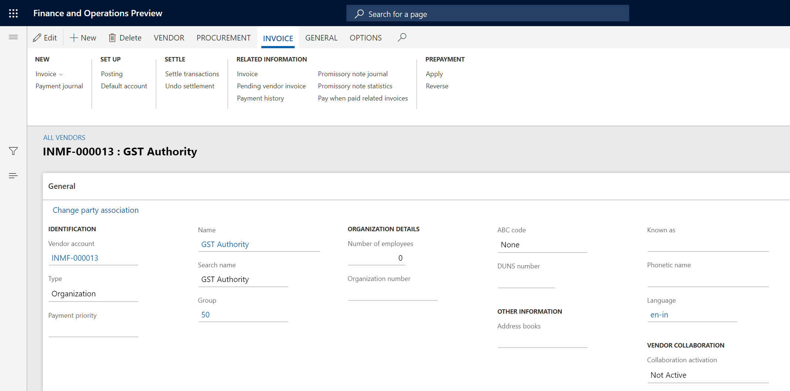
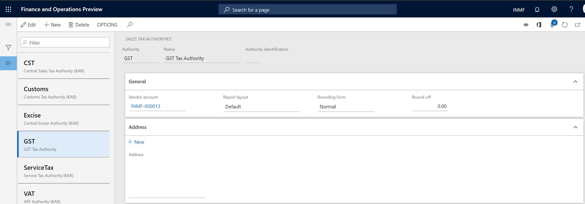
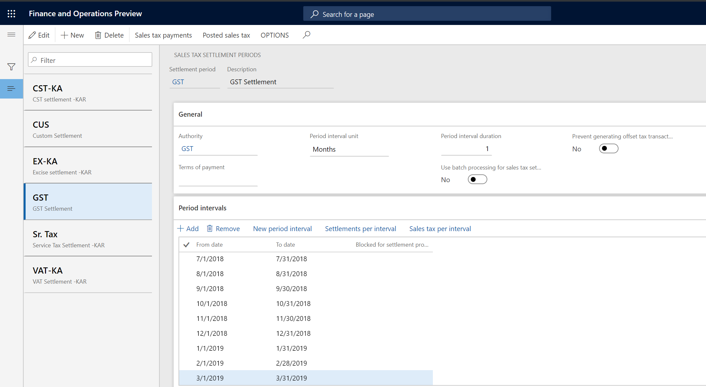

To enable India localization solution for GST in Dynamics 365 for finance and operation, below master data setup configurations are required:

- Define business vertical
- Update the state code and union territory
- Create a GSTIN master
- Define GSTIN numbers for the legal entity, warehouse, vendor, or customer masters
- HSN codes and Service accounting codes
- Create main accounts for the GST posting type
- Create a tax settlement period
- Attach the GSTIN to a tax registration group

This article describes how to create a tax settlement period

## Create a tax settlement period

1 Click **Accounts payable > Vendors > All vendors**, and create a GST authority

2 Click **Tax > Indirect tax > Sales tax > Sales tax authorities**, create a tax authority and assign step 1 vendor account to it

3 Click **Tax > Indirect tax > Sales tax > Sales tax settlement periods**, and create a tax period for GST

