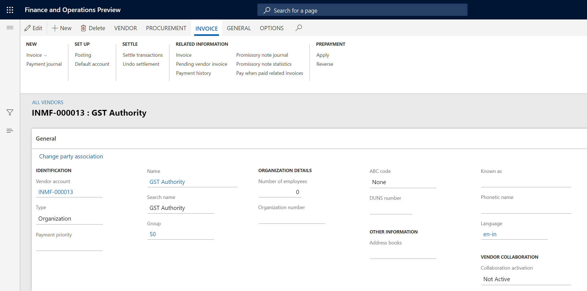

---
# required metadata

title: Create a tax settlement period
description:  This topic includes information about Indis GST Whitepaper in Microsoft Dynamics 365 for Finance and Operations.
author: EricWang
manager: RichardLuan
ms.date: 06/04/2019
ms.topic: article
ms.prod: 
ms.service: dynamics-365-applications
ms.technology: 

# optional metadata

# ms.search.form: 
audience: Application User
# ms.devlang: 
ms.reviewer: 
ms.search.scope: Core, Operations
# ms.tgt_pltfrm: 
# ms.custom: 
ms.search.region: India
# ms.search.industry: 
ms.author: EricWang
ms.search.validFrom: 2019-06-01
ms.dyn365.ops.version: 10.0.4

---

To enable India localization solution for GST in Dynamics 365 for finance and operation, below master data setup configurations are required:

- Define business vertical
- Update the state code and union territory
- Create a GSTIN master
- Define GSTIN numbers for the legal entity, warehouse, vendor, or customer masters
- HSN codes and Service accounting codes
- Create main accounts for the GST posting type
- Create a tax settlement period
- Attach the GSTIN to a tax registration group

This article describes how to create a tax settlement period

# Create a tax settlement period

1 Click **Accounts payable > Vendors > All vendors**, and create a GST authority

2 Click **Tax > Indirect tax > Sales tax > Sales tax authorities**, create a tax authority and assign step 1 vendor account to it

3 Click **Tax > Indirect tax > Sales tax > Sales tax settlement periods**, and create a tax period for GST

