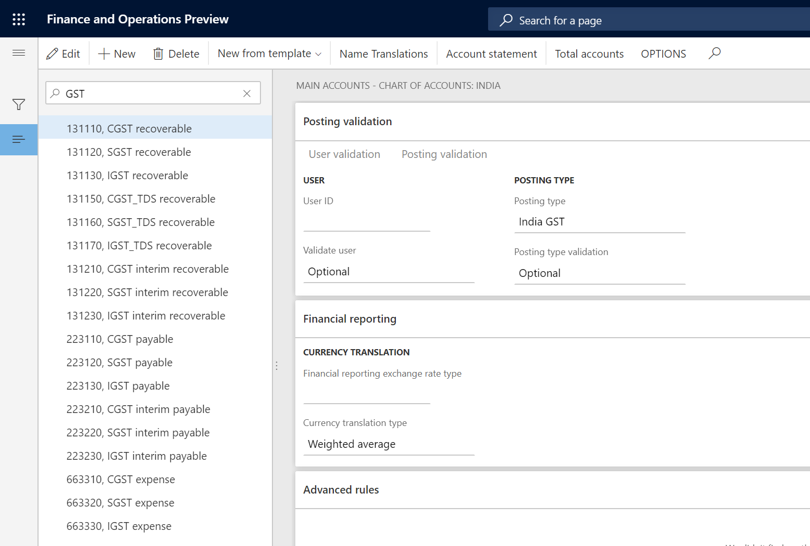

To enable India localization solution for GST in Dynamics 365 for finance and operation, below master data setup configurations are required:

- Define business vertical
- Update the state code and union territory
- Create a GSTIN master
- Define GSTIN numbers for the legal entity, warehouse, vendor, or customer masters
- HSN codes and Service accounting codes
- Create main accounts for the GST posting type
- Create a tax settlement period
- Attach the GSTIN to a tax registration group

This article describes how to create main accounts for the GST posting type

## Create main accounts for the GST posting type

1. Click **General ledger > Chart of Accounts > Accounts > Main accounts**
2. Create a record
3. In the **Main account** field, enter a value
4. In the **Name** field, enter a value
5. On the **General** FastTab, in the **Main account type** field, select a value
6. On the **Setup** FastTab, in the **Posting type** field, select GST
7. Repeat steps 2 through 6 to create all the other required state-wide ledger accounts
8. **Save** and **Close**

