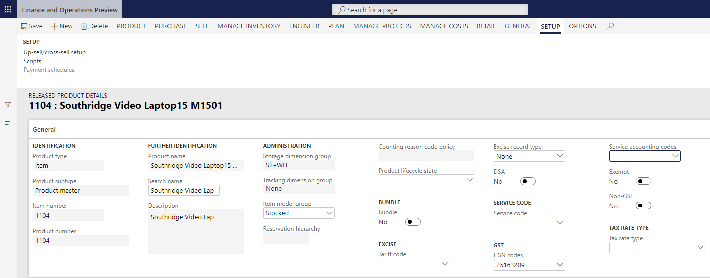
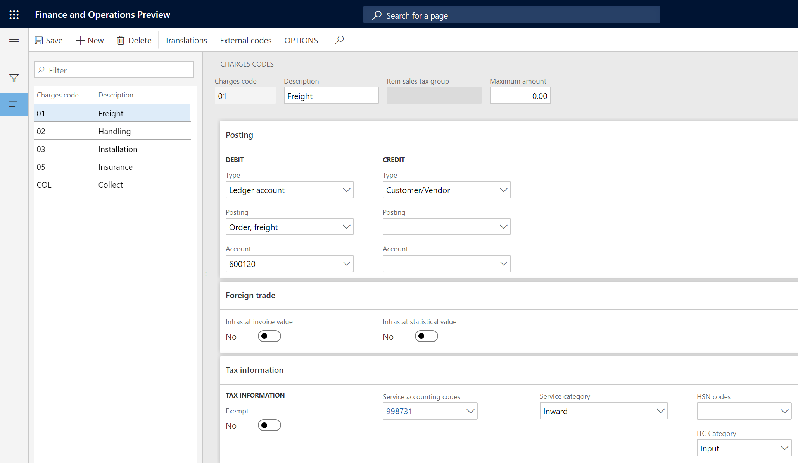

---
# required metadata

title: Define HSN codes
description:  This topic includes information about Indis GST Whitepaper in Microsoft Dynamics 365 for Finance and Operations.
author: EricWang
manager: RichardLuan
ms.date: 06/04/2019
ms.topic: article
ms.prod: 
ms.service: dynamics-365-applications
ms.technology: 

# optional metadata

# ms.search.form: 
audience: Application User
# ms.devlang: 
ms.reviewer: 
ms.search.scope: Core, Operations
# ms.tgt_pltfrm: 
# ms.custom: 
ms.search.region: India
# ms.search.industry: 
ms.author: EricWang
ms.search.validFrom: 2019-06-01
ms.dyn365.ops.version: 10.0.4

---

To enable India localization solution for GST in Dynamics 365 for finance and operation, below master data setup configurations are required:

- Define business vetical
- Update the state code and union territory
- Create a GSTIN master
- Define GSTIN numbers for the legal entity, warehouse, vendor, or customer masters
- HSN codes and Service accounting codes
- Create main accounts for the GST posting type
- Create a tax settlement period
- Attach the GSTIN to a tax registration group

This artical describes how to define HSN codes and Service accounting codes

# Define HSN codes

1. Click **Tax > Setup > Sales tax > India > HSN code**
2. Create a record
3. In the **Chapter** field, enter a value
4. In the **Heading** field, enter a value
5. In the **Subheading** field, enter a value
6. In the **Country/region extension** field, enter a value
7. In the **Statistical suffix** field, enter a value
8. Save the record
9. Verify that the **HSN code** field is updated
10. In the **Description** field, enter a value
11. Click **Close**

## Define service accounting codes

1. Click **Tax > Setup > Sales tax > India > Service accounting codes**
2. Create a record
3. In the **SAC** field, enter a value
4. In the **Description** field, enter a value
5. **Save** and **Close**

## Assign HSN codes and Service accounting codes to products

1. Click **Product information management > Products > Released products**
2. Select a product
3. click **Edit**
4. On the General tab, in the **HSN code** field or **Service accounting codes** field, select a value depends on the **Product type** is **Item** or **Service**
5. **Save** and **Close**

Note: The following setup is required for the calculation of GST:

- A Harmonized System of Nomenclature (HSN) code should be defined for the Item product type, or a Service accounting code (SAC) should be defined for the Service product type.
- Item sales tax group should be removed.

## Assign a Service accounting code to miscellaneous charges

### Accounts payable

1. Click **Accounts payable > Charges Setup > Charges code**
2. Select a charges code
3. On the **Tax information** FastTab, enter a value in the **SAC or HSN code** field
4. Enter a value in the **Service category or ITC Category** field
5. Select the **Exempt** check box to exempt these charges from the calculation of GST
6. **Save** the record

Note: When this charges code is selected for a transaction, the defined tax information automatically entered, and GST is calculated accordingly

### Accounts receivable

1. Click **Accounts receivable > Charges Setup > Charges code**

2. Select a charges code

3. On the **Tax information** FastTab, enter a value in the **SAC or HSN code** field

4. Select the **Exempt** check box to exempt this charges from the calculation of GST

5. **Save** the record

Note: When this charges code is selected for a transaction, the defined tax information is automatically entered, and GST is calculated accordingly

