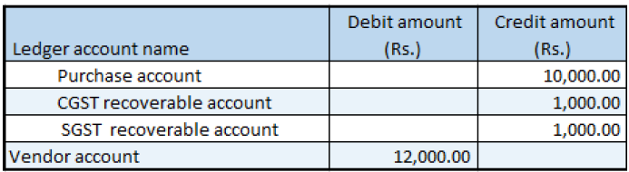

## Credit note against the purchase invoice

1. Click **Accounts payable > Purchase orders > All purchase orders**.
2. Create a purchase order.
3. On the Action Pane, on the **Purchase** tab, click **Create credit note**.
4. Select the invoice to issue a credit note against.
5. Click **OK**.
6. Verify that the **Original invoice number** and **Original invoice date** fields are automatically set on the order line.
7. Click **Tax information**.
8. Click the **GST** tab.
9. Click the **Vendor tax information** tab.
10. Click **OK**.

### Validate the tax details

11. On the Action Pane, on the **Purchase** tab, in the **Tax** group, click **Tax document**.
12. Click **Close**.
13. Click **Confirm**.

### Post the purchase invoice

14. On the Action Pane, on the **Invoice** tab, in the **Generate** group, click **Invoice**.
15. In the **Default quantity for lines** field, select **Ordered quantity**.
16. Enter the invoice number.
17. On the Lines FastTab, verify that the Invoice type field is set to Original.
Note: You can post a revised credit note by selecting Revised in the Invoice type field and adding a reference to the original credit note.
18. On the Action Pane,  click **Post > Post**.
19. On the Action Pane, on the **Invoice** tab, in the **Journals** group, click **Invoice**. Then, on the **Overview** tab, click **Voucher**.

Note: The general journal also lets you create a purchase credit note that has details of the original invoice.

