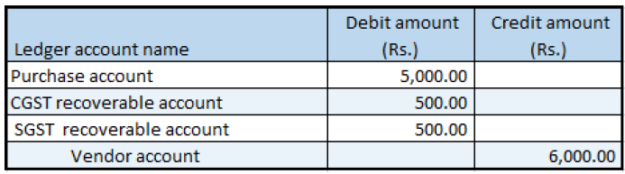

---
# required metadata

title: Debit note against the purchase invoice
description:  This topic includes information about Indis GST Whitepaper in Microsoft Dynamics 365 for Finance and Operations.
author: EricWang
manager: RichardLuan
ms.date: 06/04/2019
ms.topic: article
ms.prod: 
ms.service: dynamics-365-applications
ms.technology: 

# optional metadata

# ms.search.form: 
audience: Application User
# ms.devlang: 
ms.reviewer: 
ms.search.scope: Core, Operations
# ms.tgt_pltfrm: 
# ms.custom: 
ms.search.region: India
# ms.search.industry: 
ms.author: EricWang
ms.search.validFrom: 2019-06-01
ms.dyn365.ops.version: 10.0.4

---

# Debit note against the purchase invoice

1. Click **General ledger > Journals > General journal**.
2. Create a journal, and define a journal name.
3. Click **Lines**.
4. In the **Account type** field, select **Vendor**.
5. In the **Account** field, select a value.
6. In the **Credit** field, enter a value.
7. In the **Offset account type** field, select **Ledger**.
8. In the **Offset account** field, select a value.
9. On the **General** tab, in the **Original purchase invoice** field group, in the **Original invoice number field**, select a value.
10. Verify that the **Original invoice date** field is automatically set, based on the original invoice.
Note: You can post a revised debit note by selecting Revised in the Invoice type field and adding a reference to the original debit note.
11. Click **Tax information**.
12. On the **GST** tab, in the **HSN code** field, select a value.
13. Click the **Vendor tax information** tab.
14. Click **OK**.

### Validate the tax details

15. Click **Tax document**.
16. Click **Close**.
17. Click **Post > Post**.
18. Close the message.

### Validate the financial entries
19. Click **Inquiries > Voucher**.

