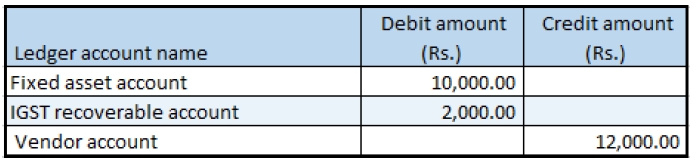

## Purchase of a fixed asset

1. Click **General ledger > Journals > General journal**.
2. Create a journal, and define a journal name.
3. Click **Lines**.
4. In the **Account type** field, select **Fixed assets**.
5. In the **Account** field, select a value.
6. In the **Debit** field, enter a value.
7. In the **Offset account type** field, select **Vendor**.
8. In the **Offset account** field, select a value.
9. Save the record.
10. Click **Tax information**.
11. On the **GST** tab, in the **HSN code** field, select a value.
12. Click the **Vendor tax information** tab.
13. Click OK.

### Validate the tax details

14. Click **Tax document**.
15. Click **Close**.
16. Click **Post > Post**.
17. Close the message.

### Validate the financial entries

18. Click **Inquiries > Voucher**

