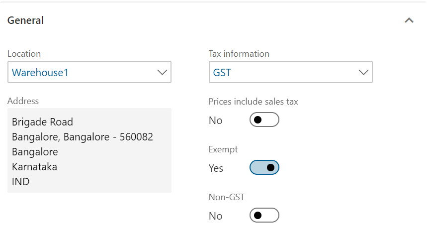
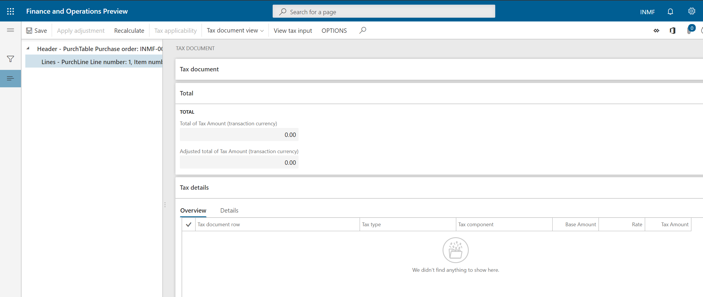
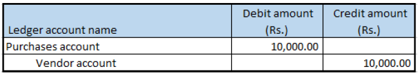

## Purchase of exempted goods

1. Click **Accounts payable > Purchase orders > All purchase orders**.
2. Create a purchase order for an exempted item.
3. Save the record.
4. Click **Tax information**.
5. On the **GST** tab, verify that the **Exempted** check box is selected by default.
6. Click **OK**.

### Validate the tax details

7. On the **Action** Pane, on the **Purchase** tab, in the **Tax** group, click **Tax document**.
8. Verify that the **Exempt** field is set to Yes and the **Tax computed** field is set to 0.00.
9. Click **Close**.
10. Click **Confirm**.

### Post the purchase invoice

11. On the **Action** Pane, on the **Invoice** tab, in the **Generate** group, click **Invoice**.
12. In the **Default quantity for lines** field, select Ordered quantity.
13. Enter the invoice number.
14. On the **Action** Pane, on the **Vendor invoice** tab, in the **Actions** group, click **Post > Post**.
15. On the **Action** Pane, on the **Invoice** tab, in the **Journals** group, click **Invoice**. Then, on the **Overview** tab, click **Voucher**.

