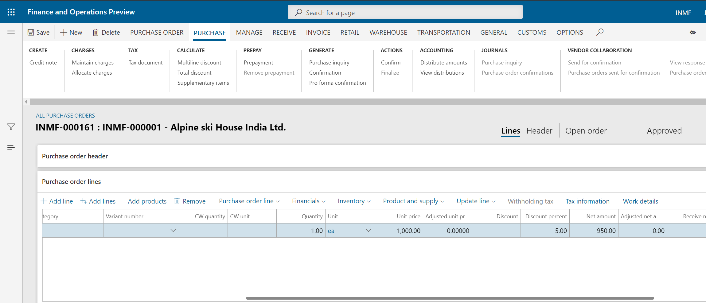
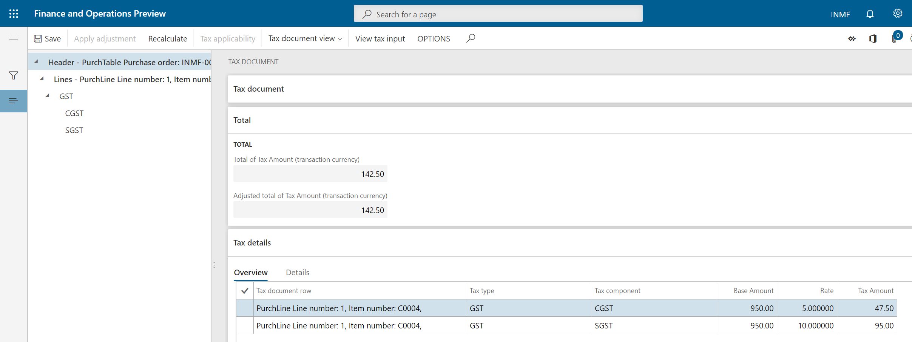
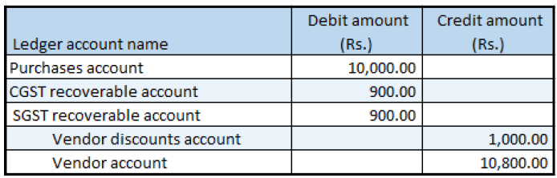

---
# required metadata

title: Indis GST Whitepaper
description:  This topic includes information about Indis GST Whitepaper in Microsoft Dynamics 365 for Finance and Operations.
author: EricWang
manager: RichardLuan
ms.date: 05/31/2019
ms.topic: article
ms.prod: 
ms.service: dynamics-365-applications
ms.technology: 

# optional metadata

# ms.search.form: 
audience: Application User
# ms.devlang: 
ms.reviewer: 
ms.search.scope: Core, Operations
# ms.tgt_pltfrm: 
# ms.custom: 
ms.search.region: India
# ms.search.industry: 
ms.author: EricWang
ms.search.validFrom: 2019-06-01
ms.dyn365.ops.version: 10.0.4

---

## Purchase of goods where there is a discount

1. Click **Accounts payable > Purchase orders > All purchase orders**.

2. Create a purchase order for a taxable item.

3. In the **Discount percent** field, enter a value.

4. Save the record.

   

### Validate the tax details

5. On the **Action** Pane, on the **Purchase** tab, in the **Tax** group, click **Tax document**.
6. Verify that the tax that is calculated considers the discount.
7. Click **Close**.
8. Click **Confirm**.

### Post the purchase invoice

9. On the **Action** Pane, on the **Invoice** tab, in the **Generate** group, click **Invoice**.
10. In the **Default quantity for lines** field, select Ordered quantity.
11. Enter the invoice number.
12. On the **Action** Pane, on the **Vendor invoice** tab, in the **Actions** group, click **Post > Post**.
13. On the **Action** Pane, on the **Invoice** tab, in the **Journals** group, click **Invoice**. Then, on the **Overview** tab, click **Voucher**.

