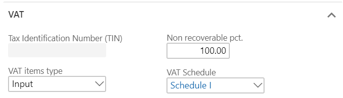
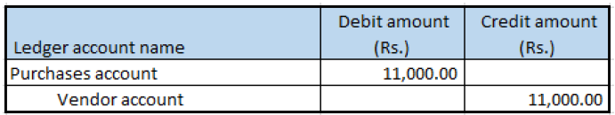

## Purchase of non-GST goods

1. Click **Accounts payable > Purchase orders > All purchase orders**.
2. Create a purchase order, and define value-added tax (VAT) tax groups.
3. Save the record.
4. Click **Tax information**.
5. In the **Tax Information** field, select the Tax Identification Number (TIN).
6. On the **VAT** tab, in the **Non recoverable pct.** field, enter **100.00**.

7. Click **OK**.
8. On the **Line details** FastTab, on the **Setup** tab, select values in the **Item sales tax group** and **Sales tax groups** fields.

### Validate the tax details

9. On the **Action** Pane, on the **Purchase** tab, in the **Tax** group, click **Sales tax**.
Note: The Tax document button isn’t available.
10. Verify that VAT is calculated.
11. Click **Close**.
12. Click **Confirm**.

### Post the purchase invoice

13. On the **Action** Pane, on the **Invoice** tab, in the **Generate** group, click **Invoice**.
14. In the **Default quantity for lines** field, select **Ordered quantity**
15. Enter the invoice number.
16. On the Action Pane, on the **Vendor invoice** tab, in the **Actions** group, click **Post > Post**.
17. On the Action Pane, on the **Invoice** tab, in the **Journals** group, click **Invoice**. Then, on the **Overview** tab, click **Voucher**.

