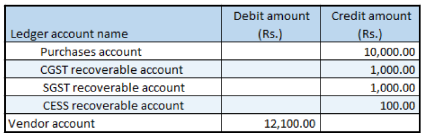

## Purchase return order

1. Click **Accounts payable > Purchase orders > All purchase orders**.
2. Create a purchase order where the **Purchase type** field is set to Returned order.
3. In the **RMA number**, enter a value.
4. Click **OK**.
5. Create purchase order lines that have a negative quantity.
6. Save the record.
7. Click **Tax information**.
8. Click the **GST** tab.
9. Click the **Vendor tax information** tab
10. Click **OK**

### Validate the tax details

11. On the Action Pane, on the **Purchase** tab, in the **Tax** group, click **Tax document**
12. Click **Close**.
13. Click **Confirm**.

### Post the purchase invoice

14. On the Action Pane, on the **Invoice** tab, in the **Generate** group, click **Invoice**.
15. In the **Default quantity for lines** field, select **Ordered quantity**.
16. Enter the invoice number.
17. On the Action Pane, on the **Vendor invoice** tab, in the **Actions** group, click **Post > Post**.
18. On the Action Pane, on the **Invoice** tab, in the **Journals** group, click **Invoice**. Then, on the **Overview** tab, click **Voucher**

