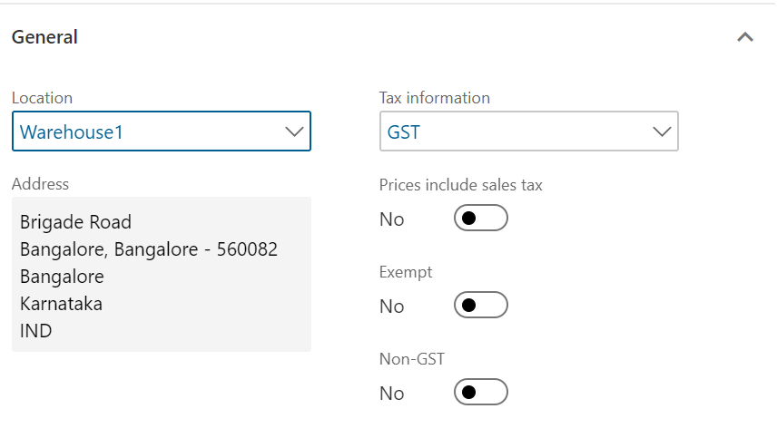
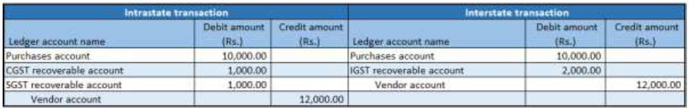
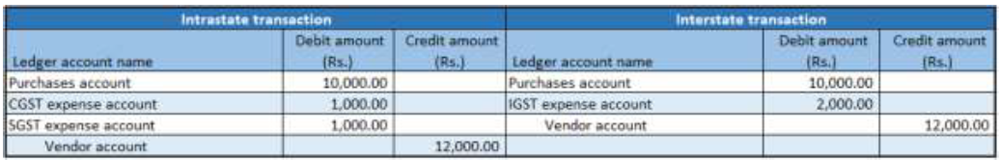
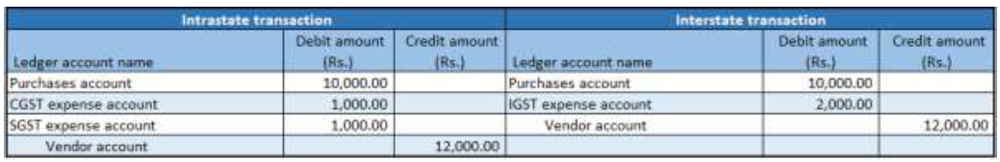
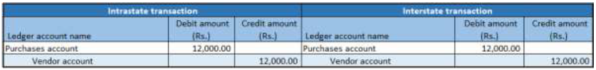
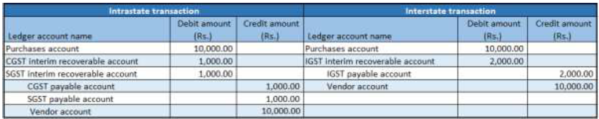
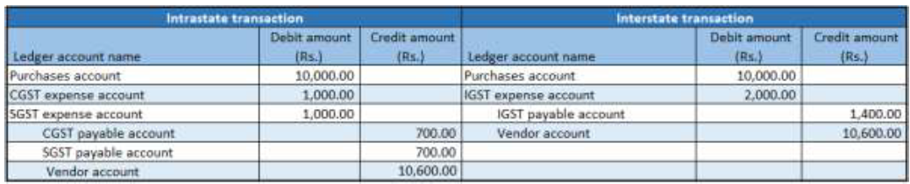

---
# required metadata

title: Purchases from a registered vendor
description: This topic provides information about working with purchases made by registered vendors..
author: EricWang
manager: RichardLuan
ms.date: 06/04/2019
ms.topic: article
ms.prod: 
ms.service: dynamics-365-applications
ms.technology: 

# optional metadata

# ms.search.form: 
audience: Application User
# ms.devlang: 
ms.reviewer: kfend
ms.search.scope: Core, Operations
# ms.tgt_pltfrm: 
# ms.custom: 
ms.search.region: India
# ms.search.industry: 
ms.author: EricWang
ms.search.validFrom: 2019-06-01
ms.dyn365.ops.version: 10.0.4

---

# Purchases from a registered vendor

## Request for quotation
1. Click **Procurement and sourcing** \> **Requests for quotations** \> **All requests for quotations**.
2. Create a new record for a taxable item.
3. On the Action Pane, on the **Quotation** tab, in the **Process** group, click **Send** and publish to the Vendor portal.
4. Click **OK**.
5. Close the message.
6. Close the **Request for quotation details** page.

## Request for quotation replies

1. Click **Procurement and sourcing** \> **Requests for quotations** \> **Request for quotation replies**.
2. Select the record.
3. On the Action Pane, on the **Reply** tab, in the **Maintain** group, click **Edit**.
4. On the Action Pane, on the **Reply** tab, in the **Process** group, click **Copy data to reply**.
5. On the **Purchase quotation lines** FastTab, click **Tax information**.

    

6. Click the **GST** tab.

    

7. Click the **Vendor tax information** tab.

    

8. Click **OK**.

## Validate the tax details

1. On the Action Pane, on the **Reply** tab, in the **Financials** group, click **Tax document**.
2. Select the **GST** node.
3. Review the tax applicability, tax attributes, and tax calculation. For example, it might look like the following:

    - Taxable value: 10,000.00
    - CGST: 10 percent
    - SGST: 10 percent

4. Click **Close**.
5. On the Action Pane, on the **Reply** tab, in the **Process** group, click **Accept**.
6. Click **OK** and close the message.
7. Close the **Request for quotation reply** page.

## Purchase order form

1. Click **Accounts payable** \> **Purchase orders \> **All purchase orders**.
2. Select the purchase order that was created through the RFQ.
3. On the Action Pane, on the **Purchase order** tab, in the **Maintain** group, click **Edit**.
4. On the **Purchase order lines** FastTab, click **Tax information**.

    

5. Click the **GST** tab.
    
    
    
6. Click the **Vendor tax information** tab.
    
    

7. Click **OK**.

## Validate the tax details

1. On the **Action** Pane, on the **Purchase** tab, in the **Tax** group, click **Tax document**.
2. Review the tax applicability, tax attributes, and tax calculation. For example, you might see the following:

    - Taxable value: 10,000.00
    - CGST: 10 percent
    - SGST: 10 percent

3. Click **Close**, and then click **Confirm**.

## Post the purchase invoice
1. On the Action Pane, on the **Invoice** tab, in the **Generate** group, click **Invoice**.
2. In the **Default quantity for lines** field, select **Ordered quantity**.
3. Enter the invoice number.
4. On the Action Pane, on the **Vendor invoice** tab, in the **Actions** group, click **Post** \> **Post**.
5. On the Action Pane, on the **Invoice** tab, in the **Journals** group, click **Invoice**. 
6. On the **Overview** tab, click **Voucher**.

- Financial entry for the purchase of goods

- Financial entry for the purchase of services

- Financial entry for the purchase of goods where the ITC category is set to Others

- Financial entry for the purchase of services where the service category is set to Others

- Financial entry for the purchase of goods where the load on inventory is set to 100 percent

- Financial entry for the purchase of goods where the reverse charge is set to 100 percent

- Financial entry for the purchase of goods where the reverse charge is set to 70 percent and the ITC category is set to Others

