---
# required metadata

title: Indis GST Whitepaper
description:  This topic includes information about Indis GST Whitepaper in Microsoft Dynamics 365 for Finance and Operations.
author: EricWang
manager: RichardLuan
ms.date: 05/31/2019
ms.topic: article
ms.prod: 
ms.service: dynamics-365-applications
ms.technology: 

# optional metadata

# ms.search.form: 
audience: Application User
# ms.devlang: 
ms.reviewer: 
ms.search.scope: Core, Operations
# ms.tgt_pltfrm: 
# ms.custom: 
ms.search.region: India
# ms.search.industry: 
ms.author: EricWang
ms.search.validFrom: 2019-06-01
ms.dyn365.ops.version: 10.0.4

---

## Purchases from a registered vendor

### Purchase of goods and services

#### Request for quotation

1. Click **Procurement and sourcing > Requests for quotations > All requests for quotations**.
2. Create a request for quotation (RFQ) for a taxable item.
3. On the **Action** Pane, on the **Quotation** tab, in the **Process** group, click **Send** and publish to Vendor portal.
4. Click **OK**.
5. Close the message.
6. Close the **Request for quotation details** form.

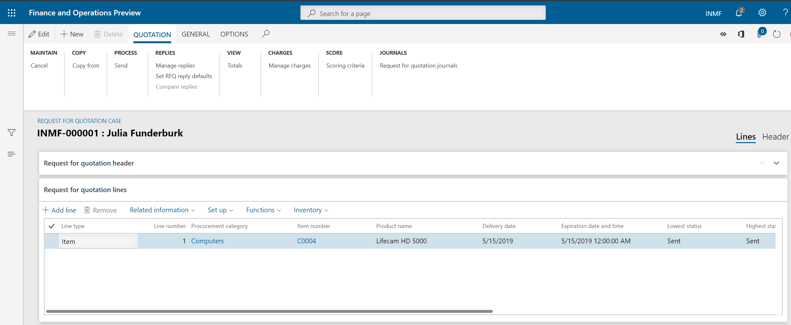

#### Request for quotation replies

7. Click **Procurement and sourcing > Requests for quotations > Request for quotation replies**.

8. Select the record.

9. On the **Action** Pane, on the **Reply** tab, in the **Maintain** group, click **Edit**.

10. On the **Action** Pane, on the **Reply** tab, in the **Process** group, click **Copy data to reply**

11. On the **Purchase quotation lines** FastTab, click **Tax information**

    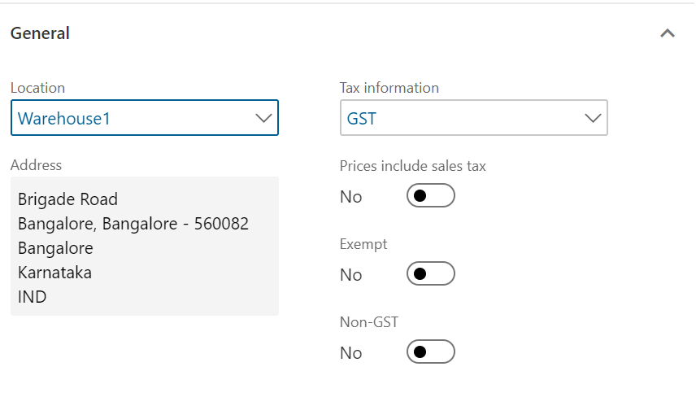

12. Click the **GST** tab

    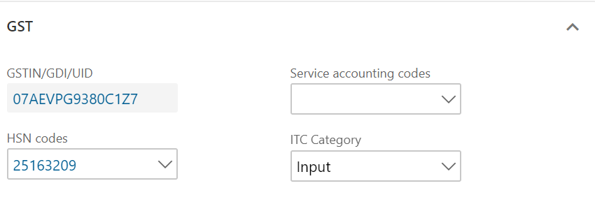

13. Click the **Vendor tax information** tab.

    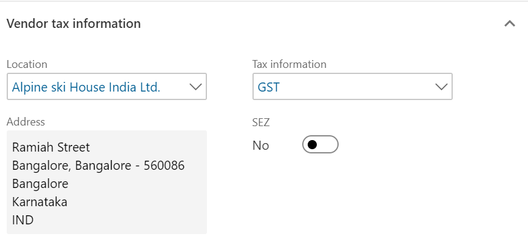

14. Click **OK**

#### Validate the tax details

15. On the **Action** Pane, on the **Reply** tab, in the **Financials** group, click **Tax document**.
16. Select the **GST** node.
17. Review the tax applicability, tax attributes, and tax calculation.

Example:

- Taxable value: 10,000.00
- CGST: 10 percent
- SGST: 10 percent

18. Click **Close**.
19. On the **Action** Pane, on the **Reply** tab, in the **Process** group, click **Accept**.
20. Click **OK**.
21. Close the message.
22. Close the **Request for quotation reply** form.

#### Purchase order form

23. Click **Accounts payable > Purchase orders > All purchase orders**.

24. Select the purchase order that was created through the RFQ.

25. On the **Action** Pane, on the **Purchase order** tab, in the **Maintain** group, click **Edit**.

26. On the **Purchase order lines** FastTab, click **Tax information**.

    

27. Click the **GST** tab.
    
28. Click the **Vendor tax information** tab
    

29. Click **OK**.

#### Validate the tax details

30. On the **Action** Pane, on the **Purchase** tab, in the **Tax** group, click **Tax document**.
31. Review the tax applicability, tax attributes, and tax calculation.

Example:

- Taxable value: 10,000.00
- CGST: 10 percent
- SGST: 10 percent

32. Click **Close**.
33. Click **Confirm**.

#### Post the purchase invoice

34. On the **Action** Pane, on the **Invoice** tab, in the **Generate** group, click **Invoice**.
35. In the **Default quantity for lines** field, select **Ordered quantity**.
36. Enter the invoice number.
37. On the **Action** Pane, on the **Vendor invoice** tab, in the **Actions** group, click **Post > Post**.
38. On the **Action** Pane, on the **Invoice** tab, in the **Journals** group, click **Invoice**. Then, on the Overview, tab, click **Voucher**.

- Financial entry for the purchase of goods

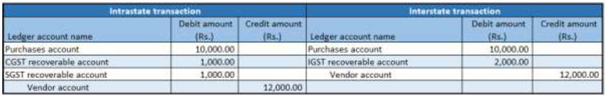

- Financial entry for the purchase of services

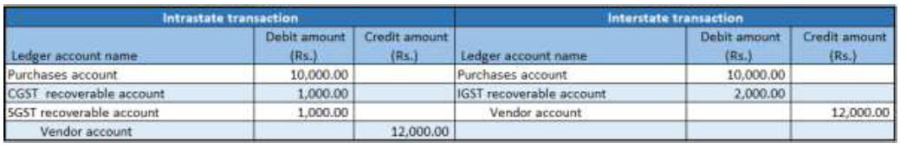

- Financial entry for the purchase of goods where the ITC category is set to Others

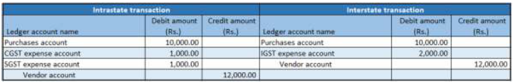

- Financial entry for the purchase of services where the service category is set to Others

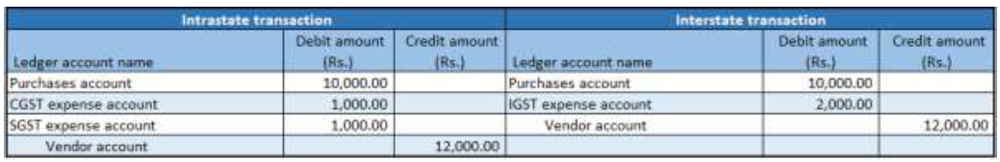

- Financial entry for the purchase of goods where the load on inventory is set to 100 percent

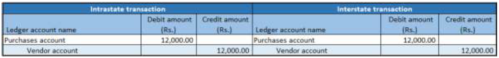

- Financial entry for the purchase of goods where the reverse charge is set to 100 percent

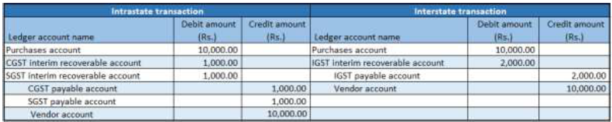

- Financial entry for the purchase of goods where the reverse charge is set to 70 percent and the ITC category is set to Others

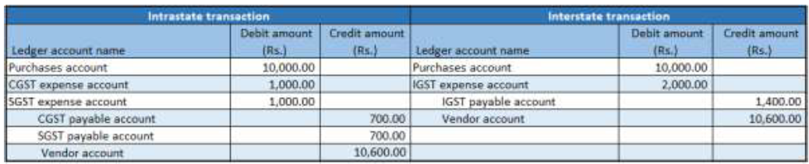

