---
# required metadata

title: Indis GST Whitepaper
description:  This topic includes information about Indis GST Whitepaper in Microsoft Dynamics 365 for Finance and Operations.
author: EricWang
manager: RichardLuan
ms.date: 05/31/2019
ms.topic: article
ms.prod: 
ms.service: dynamics-365-applications
ms.technology: 

# optional metadata

# ms.search.form: 
audience: Application User
# ms.devlang: 
ms.reviewer: 
ms.search.scope: Core, Operations
# ms.tgt_pltfrm: 
# ms.custom: 
ms.search.region: India
# ms.search.industry: 
ms.author: EricWang
ms.search.validFrom: 2019-06-01
ms.dyn365.ops.version: 10.0.4

---

## Purchases from an unregistered vendor

### Purchase requisition

1. Click **Procurement and sourcing > Purchase requisitions > All purchase requisitions**

2. Create a purchase requisition for a taxable item

3. Save the record. The **Tax information** button becomes available

   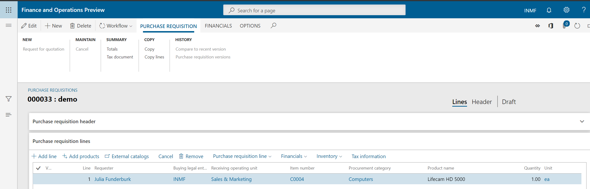

4. Click **Tax information**

5. On the **GST** tab, validate the default values for the following fields

- GSTIN/GDI/UID
- HSN code
- ITC category: Input
- Service category: Inward

6. Click the **Vendor tax information** tab

Notes:
- The Tax information field is blank for the vendor. Therefore, the dealer is an unregistered dealer.

7. Click **OK**

   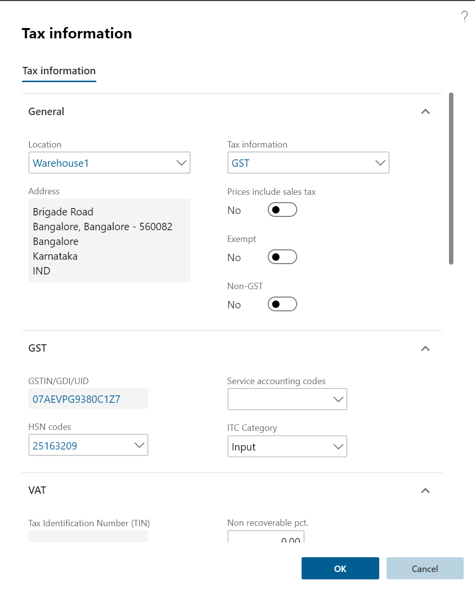

8. On the **Action** Pane, on the **Purchase Requisition** tab, in the **Summary**, click **Tax document** to review the calculated taxes.

  Example:
- Taxable value: 1,000.00

- CGST: 5 percent

- SGST: 10 percent

  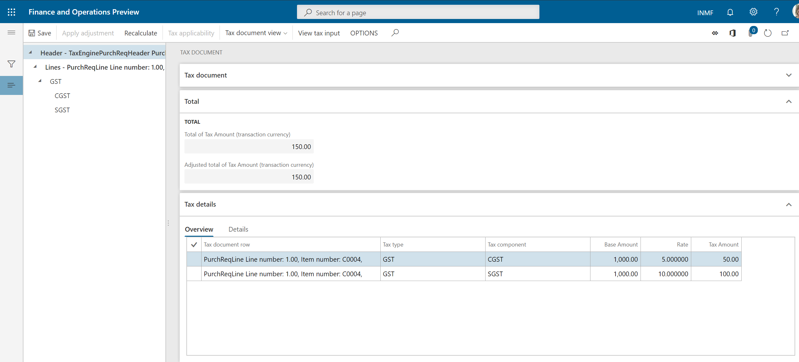

9. Click **Close**.
10. Click **Submit**.
11. **Update** the comment, and then click **Submit** to process the purchase requisition through a workflow.

### Approve the purchase requisition

12. Click **Procurement and sourcing > Purchase requisitions > Purchase requisitions prepared by**
    **me**.
13. Select the purchase requisition.
14. Click **Actions** > **Approve**.
15. Update the comment, and then click **Approve**.

### Release the approved purchase requisition

16. Click **Procurement and sourcing > Purchase requisitions > Release approved purchase**
**requisition**.
17. Select the purchase requisition
18. Click **New Purchase order**
19. Close the message

### Purchase order form

20. Click **Accounts payable > Purchase orders > All purchase orders**.
21. Select the purchase order.
22. On the **Purchase order lines** FastTab, click **Tax information**
24. Click the **GST** tab
25. Click the **Vendor tax information** tab
26. Click **OK**

### Validate the tax details

27. On the **Action** Pane, on the **Purchase** tab, in the **Tax group**, click **Tax document** to review the calculated taxes.

Example:

- Taxable value: 1,000.00
- CGST: 5 percent
- SGST: 10 percent

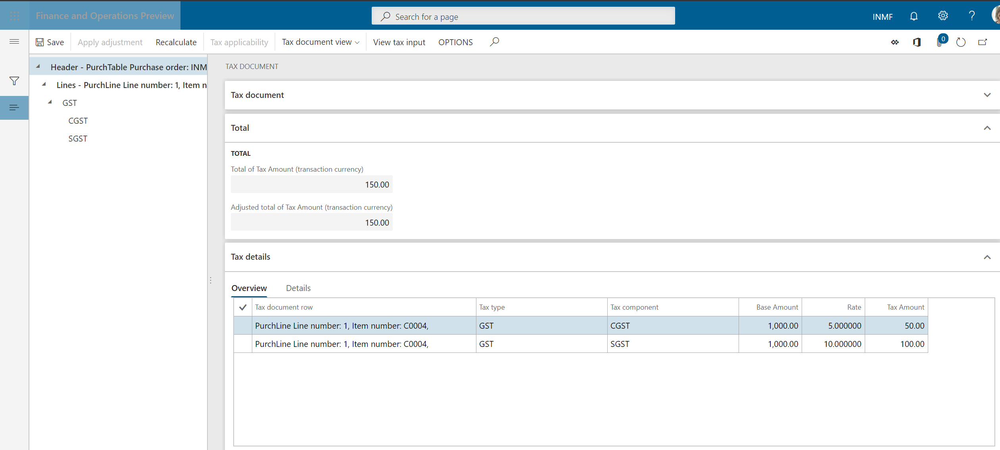

If you change any tax attributes after the order line is created, click Recalculate to recalculate tax

28. Click **Close**.
29. Click **Confirm**.

### Post the purchase invoice

30. On the **Action** Pane, on the **Invoice** tab, in the **Generate** group, click **Invoice**.
31. In the **Default quantity for lines** field, select Ordered quantity.
32. Enter the **invoice number**.
33. On the **Action** Pane, on the **Vendor invoice** tab, in the **Actions** group, click **Post > Post**.
34. On the **Action** Pane, on the **Invoice** tab, in the **Journals** group, click **Invoice**. Then, on the Overview tab, click Voucher.
- Financial entry for the purchase of goods

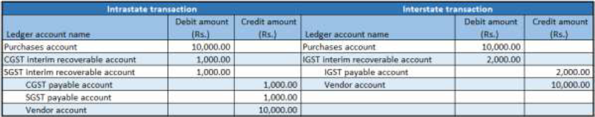

Note: After the authority payment, the credit should be claimed

- Financial entry for the purchase of services

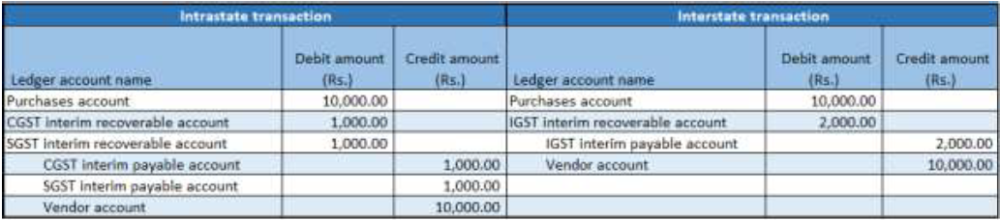

Tax liability arises on invoice payment

- Financial entry on invoice payment

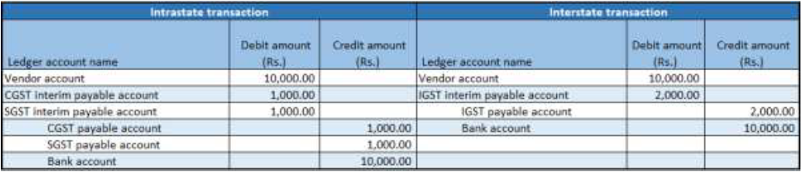

Note: An appropriate Service accounting code must be selected

- Financial entry for the purchase of goods where the ITC category is set to Others

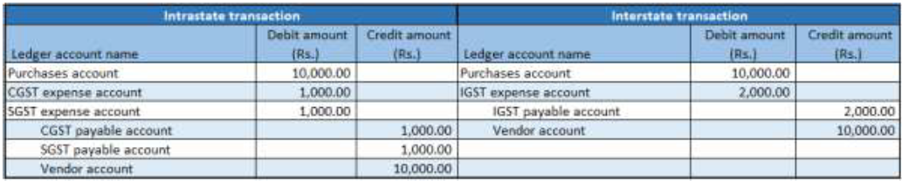

- Financial entry for the purchase of services where the service category is set to Others

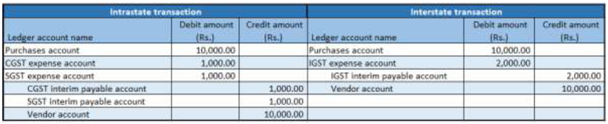

Tax liability arises on invoice payment

- Financial entry on invoice payment

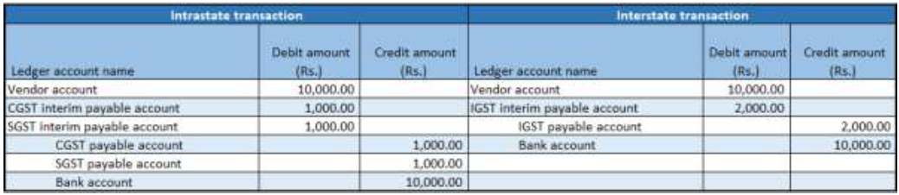

- Financial entry for purchases where the load on inventory is set to 100 percent

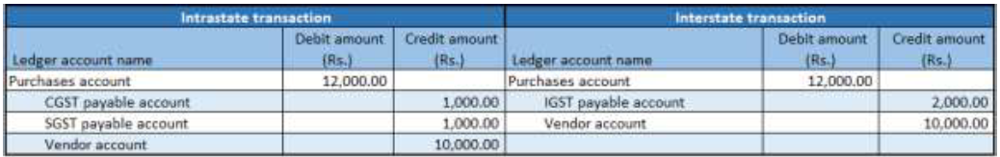

