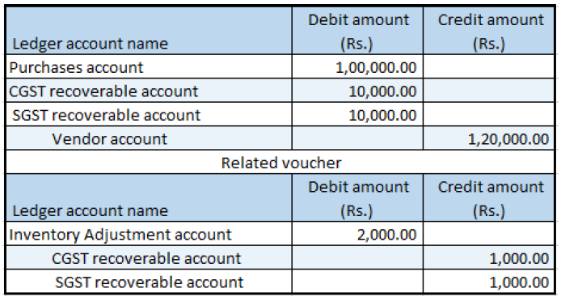

---
# required metadata

title: Indis GST Whitepaper
description:  This topic includes information about Indis GST Whitepaper in Microsoft Dynamics 365 for Finance and Operations.
author: EricWang
manager: RichardLuan
ms.date: 05/31/2019
ms.topic: article
ms.prod: 
ms.service: dynamics-365-applications
ms.technology: 

# optional metadata

# ms.search.form: 
audience: Application User
# ms.devlang: 
ms.reviewer: 
ms.search.scope: Core, Operations
# ms.tgt_pltfrm: 
# ms.custom: 
ms.search.region: India
# ms.search.industry: 
ms.author: EricWang
ms.search.validFrom: 2019-06-01
ms.dyn365.ops.version: 10.0.4

---

## Quality order that involves destruction of the sampling item

### Purchase order form

1. Click **Accounts payable > Purchase orders > All purchase orders**.
2. Create a purchase order.

### Validate the tax details

3. On the Action Pane, on the **Purchase** tab, in the **Tax** group, click **Tax document**.

Example:

- Taxable value: 10,000.00
- CGST: 10 percent
- SGST: 10 percent

4. Click **Close**.
5. Click **Confirm**.

### Post the packing slip

6. On the Action Pane, on the **Receive** tab, in the **Generate** group, click **Product receipt**.
7. In the **Quantity** field, select **Ordered quantity**.
8. In the **Product receipt** field, enter a value.
9. Click **OK**.
10. Click **Show**.

### Quality order form

11. Click **Results**.
12. Update the **Result quantity** field.
13. Click **Validate**.
14. Click **Close**.
15. Click **Tax document**.
Note: Tax is calculated for the quantity that was used for the quality check and destroyed.
16. Click **Close**.
17. Click **Validate**.
18. In the **Validate by** field, select a value.
19. Click **OK**.
20. Close the **Quality orders form**.

### Post the purchase invoice

21. On the Action Pane, on the **Invoice** tab, in the **Generate** group, click **Invoice**.
22. Enter the invoice number.
23. On the Action Pane, on the **Vendor invoice** tab, in the **Actions** group, click **Post > Post**.
24. On the Action Pane, on the **Invoice** tab, in the **Journals** group, click **Invoice**. Then, on the **Overview** tab, click **Voucher**.

