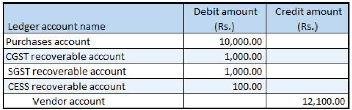

## Revised purchase invoice that has taxable goods

1. Click **Accounts payable > Purchase orders > All purchase orders**.
2. Create a purchase order for a taxable item

### Validate the tax details

3. On the Action Pane, on the **Purchase** tab, in the **Tax** group, click **Tax document**.
4. On the **Tax details** FastTab, review the tax calculation.

Example:

- Line amount: 10,000.00
- CGST: 10 percent
- SGST: 10 percent
- CESS: 1 percent

5. Click **Close**.
6. Click **Confirm**.

### Post the purchase invoice

7. On the Action Pane, on the **Invoice** tab, in the **Generate** group, click **Invoice**.
8. In the **Default quantity for lines** field, select **Ordered quantity**.
9. On the **Lines** FastTab, enter the invoice number.
10. In the **Invoice type** field, select **Revised**.
11. In the **Original invoice number** field, select a value.
12. Verify that the **Original invoice date field** is automatically set, based on the original invoice number that you selected.
13. On the Action Pane, on the **Vendor invoice** tab, in the **Actions** group, click **Post > Post**.
14. On the Action Pane, on the **Invoice** tab, in the **Journals** group, click **Invoice**. Then, on the Overview tab, click Voucher.

