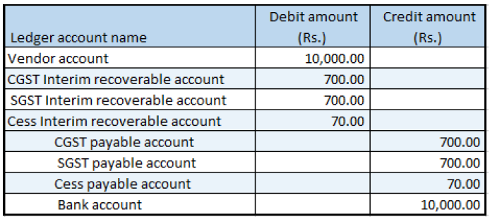

## Vendor advance payment where there are reverse charges

1. Click **Accounts payable > Payments > Vendor Payment journal**.
2. Create a record.
3. In the **Name** field, select a value.
4. Click **Lines**.
5. Create a vendor advance payment journal.
6. Save the record.
7. Click **Tax information**.
8. On the **GST** tab, in the **HSN code** field, select a value.
9. Click the **Vendor tax information** tab.
10. Click OK.

### Validate the tax details

11. On the Action Pane, on the **Purchase** tab, in the **Tax** group, click **Tax document**.

Example:

- CGST: 10 percent
- SGST: 10 percent
- CESS: 1 percent
- Reverse charge percentage: 70 percent for all the three components

12. Click **Close**.
13. Click **Post > Post**.
14. Close the message.

### Update the transaction ID

15. Click **Functions > GST transaction Id**.
16. In the **Date** field, enter a value.
17. In the **Text** field, enter a value.
18. Click **Close**.

### Validate the financial entries
19. Click **Inquiries > Voucher**.

