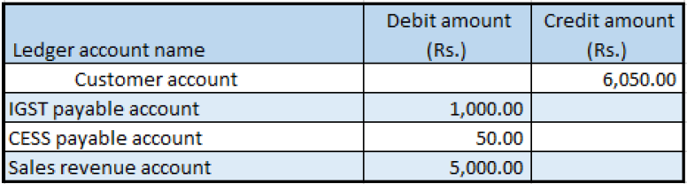

---
# required metadata

title: Indis GST Whitepaper
description:  This topic includes information about Indis GST Whitepaper in Microsoft Dynamics 365 for Finance and Operations.
author: EricWang
manager: RichardLuan
ms.date: 05/31/2019
ms.topic: article
ms.prod: 
ms.service: dynamics-365-applications
ms.technology: 

# optional metadata

# ms.search.form: 
audience: Application User
# ms.devlang: 
ms.reviewer: 
ms.search.scope: Core, Operations
# ms.tgt_pltfrm: 
# ms.custom: 
ms.search.region: India
# ms.search.industry: 
ms.author: EricWang
ms.search.validFrom: 2019-06-01
ms.dyn365.ops.version: 10.0.4

---

## Credit note against the sales invoice

### Sales order form

1. Click **Accounts receivable > Sales orders > All sales orders**.
2. Create a sales credit note for a taxable item.
3. In the **Original invoice number** field, select a value.
4. Verify that the **Original invoice date** field is automatically set, based on the original invoice number that you selected.
5. Save the record.
6. Click **Tax information**.
7. Click the **GST** tab
8. Click the **Customer tax information** tab
9. Click OK.
10. On the Action Pane, on the **Sell** tab, in the **Tax** group, click **Tax document**.

Example:

- Taxable amount: -5,000
- IGST: 20 percent
- CESS: 1 percent

11. Click Close.

### Post the invoice

12. On the Action Pane, on the **Invoice** tab, in the **Generate** group, click **Invoice**.
13. In the **Quantity** field, select **All**.
14. On the **Others** tab, verify that the **Invoice type** field is set to Original.
Note: You can post a revised credit note by selecting Revised in the Invoice type field and adding a reference to the original credit note.
15. Click OK.
16. Click Yes to acknowledge the warning message.

### Validate the voucher

17. On the Action Pane, on the **Invoice** tab, in the **Journals** group, click **Invoice**.
18. Click **Voucher**.

Note: You can also create a sales credit note through the general ledger and a free text invoice

