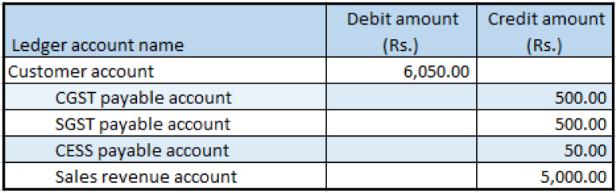

## Debit note against the sales invoice

1. Click **General ledger > Journals > General journal**.
2. Create a journal, and define a journal name.
3. Click **Lines**
4. In the **Account type** field, select **Customer**.
5. In the **Account** field, select a value.
6. In the **Debit** field, enter a value.
7. In the **Offset account type** field, select **Ledger**.
8. In the **Offset account** field, select a value.
9. Click **Tax information**
10. On the **GST** tab, in the **HSN code** field, select a value
11. Click the **Customer tax information** tab
12. Click **Tax Document**
13. In **Header -> Tax document**, in **Transaction type** field, select **revised**
14. Select **Original transaction id** field and **Original transaction date** field
15. Click **OK**.

### Validate the tax details

16. Click **Tax document**
17. Click Close.
18. Click **Post > Post**.
19. Close the message

### Validate the financial entries

20. Click **Inquiries > Voucher**

