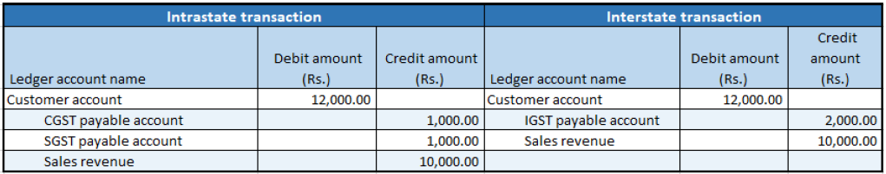

## Free text invoices

1. Click **Accounts receivable > Free text invoices > All free text invoices**.
2. Create a free text invoice for taxable services.
3. Save the record.
4. Click **Tax information**.
5. On the **GST** tab, in the **SAC** field, select a value.
6. Click the **Customer tax information** tab

7. Click **OK**.
8. On the Action Pane, on the **Invoice** tab, in the **Details** group, click **Tax document**.

Example:

- Taxable value: 10,000.00
- CGST: 10 percent
- SGST: 10 percent

9. Click **Close**.

### Post the invoice

10. On the Action Pane, on the **Invoice** tab, click **Post > Post**.
11. Click **OK**.
12. Close the message.

### Validate the voucher

13. On the Action Pane, on the **Invoice** tab, in the **Related information** group, click **Invoice journal**.
14. Click **Voucher**.

Financial entries for both the intrastate and interstate transactions

