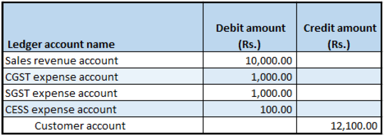
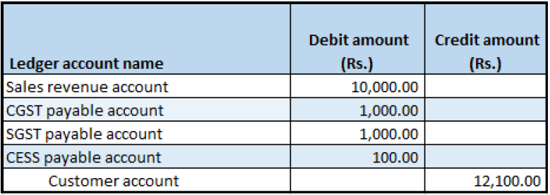

## Return order form

1. Click **Sales and marketing > Return orders > All return orders**.
2. Create a return order for a taxable item.
3. On the **Line details** FastTab, in the **Disposition code** field, select **Credit only**.
4. On the Action Pane, on the **Return order** tab, in the **Send** group, click **Return order**.
5. Click **OK**.
6. Close the form.

### Sales order form

7. Click **Accounts receivable > Sales orders > All sales orders**.
8. Select the record where the **Order type** field is set to **Returned order**.
9. On the Action Pane, on the **Sales order** tab, in the **Maintain** group, click **Edit**.
10. Click **Tax information**
11. Click the **GST** tab.
12. Click the **Customer tax information** tab

Note: The Tax information value is automatically set, based on the original sales order that the return order is created against.

13. Click OK.
14. On the Action Pane, on the **Sell** tab, in the **Tax** group, click **Tax document**.

Example:

- Taxable amount: 10,000
- CGST: 10 percent
- SGST: 10 percent
- CESS: 1 percent

15 Click Close.

### Post the invoice

16. On the Action Pane, on the **Invoice** tab, in the **Generate** group, click **Invoice**.
17. In the **Quantity** field, select **All**.
18. Click OK.
19. Click Yes to acknowledge the warning message.

### Validate the voucher

20. On the Action Pane, on the **Invoice** tab, in the **Journals** group, click **Invoice**.
21. Click **Voucher**.

Financial entry for the Credit only/Replace and scrap/Scrap disposition code

Financial entry for the Credit/Replace and credit disposition code

