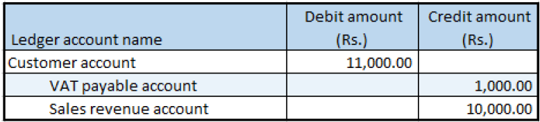

## Sale of non-GST goods

1. Click **Accounts receivable > Sales orders > All sales orders**.
2. Create a sales order, and define **VAT tax groups**.
3. Select the record.
4. Click **Tax information**
5. In the **Tax information** field, select a value that has a **Tax Identification Number** (TIN) associated with it.
6. Click the **GST** tab
7. Click the **Customer tax information** tab.
8. Click **OK**.
9. On the Action Pane, on the **Sell** tab, in the **Tax** group, click **Sales tax**.
10. Click **Close**.

### Post the invoice

11. On the Action Pane, on the **Invoice** tab, in the **Generate** group, click **Invoice**.
12. In the **Quantity** field, select **All**.
13. Click OK.
14. Click Yes to acknowledge the warning message

### Validate the voucher

15. On the Action Pane, on the **Invoice** tab, in the **Journals** group, click **Invoice**.
16. Click **Voucher**.

