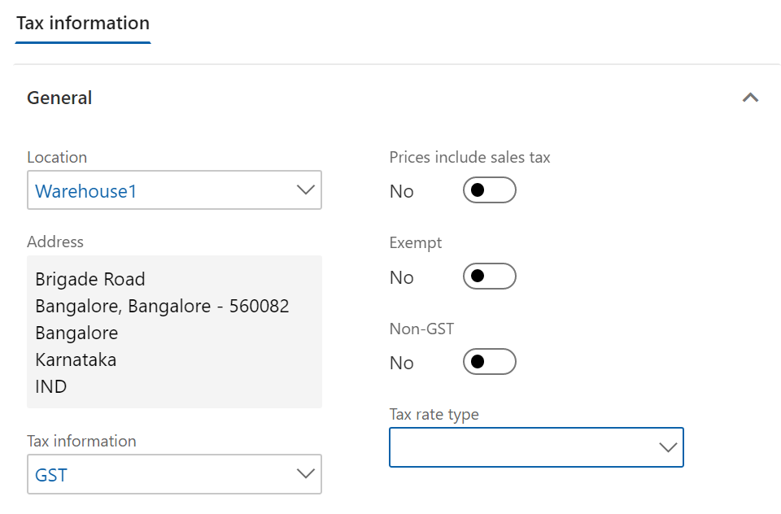
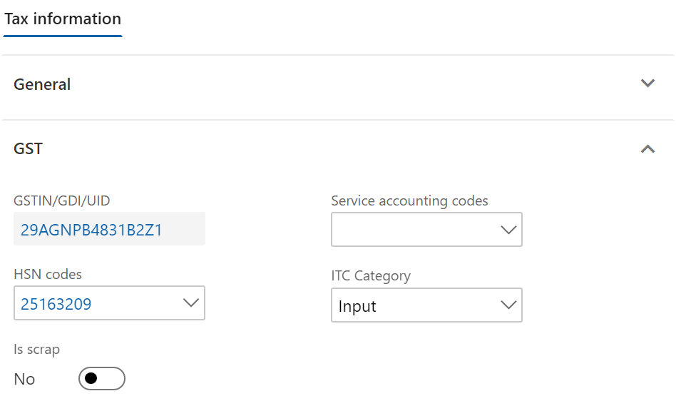
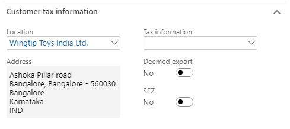
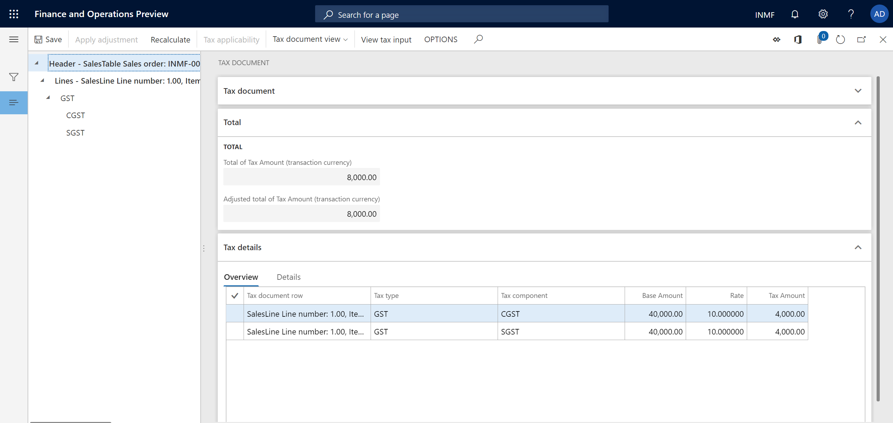
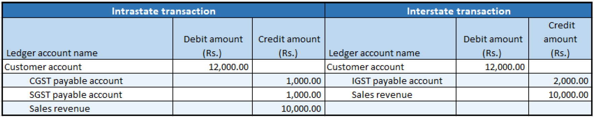

---
# required metadata

title: Indis GST Whitepaper
description:  This topic includes information about Indis GST Whitepaper in Microsoft Dynamics 365 for Finance and Operations.
author: EricWang
manager: RichardLuan
ms.date: 05/31/2019
ms.topic: article
ms.prod: 
ms.service: dynamics-365-applications
ms.technology: 

# optional metadata

# ms.search.form: 
audience: Application User
# ms.devlang: 
ms.reviewer: 
ms.search.scope: Core, Operations
# ms.tgt_pltfrm: 
# ms.custom: 
ms.search.region: India
# ms.search.industry: 
ms.author: EricWang
ms.search.validFrom: 2019-06-01
ms.dyn365.ops.version: 10.0.4

---

## Sale of taxable goods to a consumer

1. Click **Accounts receivable > Sales orders > All sales orders**.
2. Create a sales order for a taxable item.
3. **Save** the record.
4. Click **Tax information**.

5. Click the **GST** tab.

6. Click the **Customer tax information** tab

Note: The Tax information field is blank. Therefore, the dealer is an unregistered dealer

7. Click **OK**.

8. On the Action Pane, on the **Sell** tab, in the **Tax** group, click **Tax document** to review the calculated taxes.

  Example:

- Taxable value: 40,000.00
- CGST: 10 percent
- SGST: 10 percent

9. Click **Close**.

### Post the invoice

10. On the Action Pane, on the **Invoice** tab, in the **Generate** group, click **Invoice**.
11. In the **Quantity** field, select **Packing slip**.
12. Select the **Print invoice** check box.
13. Click **OK**.
14. Click **Yes** to acknowledge the warning message.

### Validate the voucher

15. On the Action Pane, on the **Invoice** tab, in the **Journals** group, click **Invoice**.
16. Click **Voucher**.

Financial entries for both the intrastate and interstate transactions

