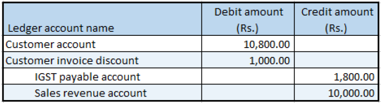

---
# required metadata

title: Sale of taxable goods where there is a discount and a provisional assessment
description:  This topic includes information about Indis GST Whitepaper in Microsoft Dynamics 365 for Finance and Operations.
author: EricWang
manager: RichardLuan
ms.date: 06/04/2019
ms.topic: article
ms.prod: 
ms.service: dynamics-365-applications
ms.technology: 

# optional metadata

# ms.search.form: 
audience: Application User
# ms.devlang: 
ms.reviewer: 
ms.search.scope: Core, Operations
# ms.tgt_pltfrm: 
# ms.custom: 
ms.search.region: India
# ms.search.industry: 
ms.author: EricWang
ms.search.validFrom: 2019-06-01
ms.dyn365.ops.version: 10.0.4

---

# Sale of taxable goods where there is a discount and a provisional assessment

### Sales order form

1. Click **Accounts receivable > Sales orders > All sales orders**.
2. Create a sales order for a taxable item.
3. Click **Header view**.
4. On the **Price and discount** FastTab, in the **Total discount %** field, enter 10.00.
5. Click **Line view**.
6. On the **Lines details** FastTab, on the **Address** tab, in the **Delivery address** field, select a value
7. Save the record
8. Click **Tax information**
9. Click the **GST** tab.
10. Click the **Customer tax information** tab
11. Click **OK**.
12. On the Action Pane, on the **Sell** tab, in the **Tax** group, click **Tax document**.
13. Verify that the tax that is calculated considers the discount
14. Click Close.

### Post the invoice

15. On the Action Pane, on the **Invoice** tab, in the **Generate** group, click **Invoice**.
16. In the **Quantity** field, select **All**.
17. Select the **Print invoice** check box.
18. Select the **Provisional assessment** check box
19. Click OK.
20. Click Yes to acknowledge the warning message

### Validate the voucher

21. On the Action Pane, on the **Invoice** tab, in the **Journals** group, click **Invoice**.
22. Click **Voucher**

