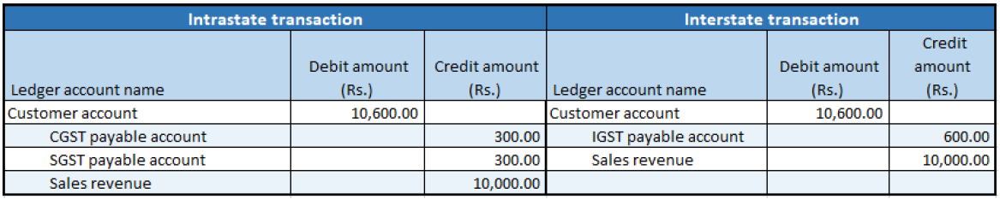

## Sale of taxable goods where there is a reverse charge

1. Click **Accounts receivable > Sales orders > All sales orders**.
2. Create a sales order for a taxable item.
3. Save the record.
4. Click **Tax information**.

5. Click the **GST** tab

6. Click the **Customer tax information** tab

7. Click OK.
8. On the Action Pane, on the **Sell** tab, in the **Tax** group, click **Tax document** to review the calculated taxes.

Example:

- Taxable value: 10,000.00
- CGST: 10 percent
- SGST: 10 percent
- Reverse charge percentage: 70 percent

9. Click **Close**.

### Post the invoice

10. On the Action Pane, on the **Invoice** tab, in the **Generate** group, click **Invoice**.
11. In the **Quantity** field, select **All**.
12. Select the **Print invoice** check box.
13. Click OK.
14. Click Yes to acknowledge the warning message

### Validate the voucher

15. On the Action Pane, on the **Invoice** tab, in the **Journals** group, click **Invoice**.
16. Click **Voucher**.

Financial entries for both the intrastate and interstate transactions

