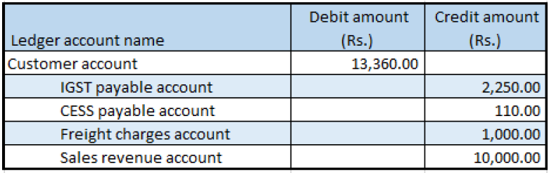

---
# required metadata

title: Indis GST Whitepaper
description:  This topic includes information about Indis GST Whitepaper in Microsoft Dynamics 365 for Finance and Operations.
author: EricWang
manager: RichardLuan
ms.date: 05/31/2019
ms.topic: article
ms.prod: 
ms.service: dynamics-365-applications
ms.technology: 

# optional metadata

# ms.search.form: 
audience: Application User
# ms.devlang: 
ms.reviewer: 
ms.search.scope: Core, Operations
# ms.tgt_pltfrm: 
# ms.custom: 
ms.search.region: India
# ms.search.industry: 
ms.author: EricWang
ms.search.validFrom: 2019-06-01
ms.dyn365.ops.version: 10.0.4

---

## Sale of taxable goods where there is tax on shipping charges

1. Click **Accounts receivable > Sales orders > All sales orders**.
2. Create a sales order for a taxable item
3. On the **Lines details** FastTab, on the **Address** tab, in the **Delivery address** field, select a value.
4. Save the records.
5. Click **Tax information**
6. Click the **GST** tab.
7. Click the **Customer tax information** tab.
8. In the **Location** field, select the value that you selected for the delivery address in step 3.
9. Click OK.
10. On the **Sales order lines** FastTab, click **Financials > Maintain charges**.
11. Select a **charges code**.
12. In the **Charges value** field, enter a value.
13. Save the record.
14. Click **Tax information**
15. Click the **GST** tab

Note: The SAC field is automatically set, based on the charges code that you selected. The default setting is defined in the charges code master.

16. Click the **Customer tax information** tab.
17. Click OK.
18. On the Action Pane, on the **Sell** tab, in the **Tax** group, click **Tax document** to review the calculated taxes.

Example:

- Line amount: 10,000.00
- IGST: 20 percent
- CESS: 1 percent
- Miscellaneous charges: 1,000.00
- IGST: 25 percent
- CESS: 1 percent

19. Click **Close**.

### Post the invoice

20. On the Action Pane, on the **Invoice** tab, in the **Generate** group, click **Invoice**.
21. In the **Quantity** field, select **All**.
22. Select the **Print invoice** check box.
23. Click OK.
24. Click Yes to acknowledge the warning message

### Validate the voucher

25. On the Action Pane, on the **Invoice** tab, in the **Journals** group, click **Invoice**.
26. Click **Voucher**

