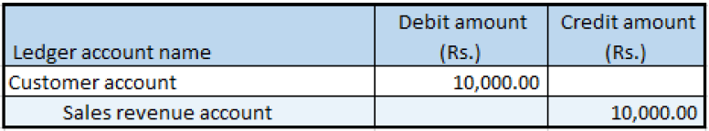

---
# required metadata

title: Sale of zero-rated goods
description:  This topic includes information about Indis GST Whitepaper in Microsoft Dynamics 365 for Finance and Operations.
author: EricWang
manager: RichardLuan
ms.date: 06/04/2019
ms.topic: article
ms.prod: 
ms.service: dynamics-365-applications
ms.technology: 

# optional metadata

# ms.search.form: 
audience: Application User
# ms.devlang: 
ms.reviewer: 
ms.search.scope: Core, Operations
# ms.tgt_pltfrm: 
# ms.custom: 
ms.search.region: India
# ms.search.industry: 
ms.author: EricWang
ms.search.validFrom: 2019-06-01
ms.dyn365.ops.version: 10.0.4

---

# Sale of zero-rated goods

1. Click **Accounts receivable > Sales orders > All sales orders**.
2. Create a sales order for a zero-rated item.
3. Select the record.
4. Click **Tax information**.
5. On the **GST** tab, verify that the **Exempted** check box is selected by default
6. Click the **Customer tax information** tab.
7. Click **OK**.
8. On the Action Pane, on the **Sell** tab, in the **Tax** group, click **Tax document**
9. Click **Close**.

### Post the invoice

10. On the Action Pane, on the **Invoice tab**, in the **Generate** group, click **Invoice**.
11. In the **Quantity** field, select **All**.
12. Click **OK**.
13. Click **Yes** to acknowledge the warning message

### Validate the voucher

14. On the Action Pane, on the **Invoice** tab, in the **Journals** group, click **Invoice**.
15. Click **Voucher**.

