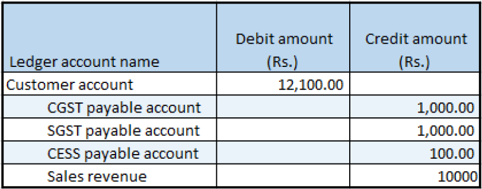
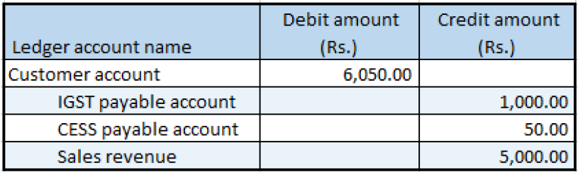

## Sales invoice that is split based on delivery addresses

1. Click **Accounts receivable > Sales orders > All sales orders**.
2. Create a sales order for taxable items.
3. On the **Lines details** FastTab, click the **Address** tab.
4. Save the records.
5. Select order line 1
6. Click **Tax information**
7. Click the **GST** tab
8. Click the **Customer tax information** tab
9. Click **OK**.
10. Select order line 2.
11. Click **Tax information**.
12. Click the **GST** tab
13. Click the **Customer tax information** tab
14. Click OK.
15. On the Action Pane, on the **Sell** tab, in the **Tax** group, click **Tax document** to review the calculated taxes.

Example:

Order line 1

- Taxable amount: 10,000.00
- CGST: 10 percent
- SGST: 10 percent
- CESS: 1 percent

Order line 2

- Taxable amount: 5,000.00
- IGST: 20 percent
- CESS: 1 percent

16. Click Close.

### Post the packing slip

17. Click the Action Pane, on the **Pick and pack** tab , in the **Generate** group, click **Packing slip**
18. Click OK

### Post the invoice

19. On the Action Pane, on the **Invoice** tab, in the **Generate** group, click **Invoice**.
20. In the **Quantity** field, select **All**

Note: The invoice is split based on the delivery addresses.

21. Click OK.
22. Click Yes to acknowledge the warning message

### Validate the voucher

23. On the Action Pane, on the **Invoice** tab, in the **Journals** group, click **Invoice**.
24. Select record with Invoice amount 12100.00
25. Click Voucher.

26. Click Close.
27. Select record with Invoice amount 6050.00
28. Click Voucher

