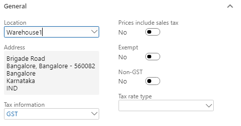
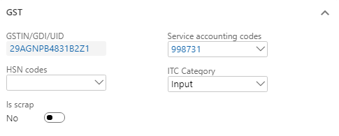
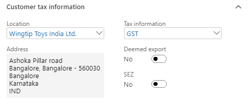
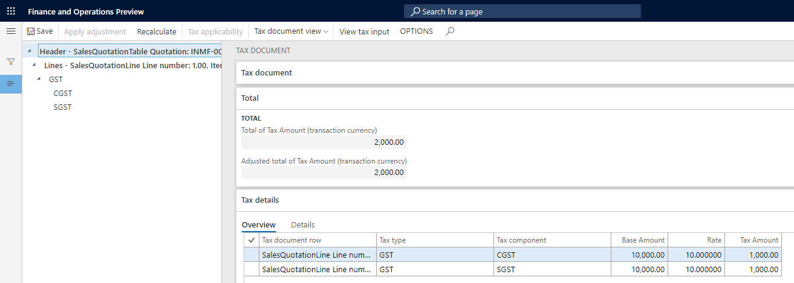

## Sales to a registered customer

### Sales quotation

1. Click **Sales and marketing > Sales quotation > All quotations**.

2. Create a quotation for a taxable item for the registered customer.

3. Save the record.

4. Click **Tax information**

   

5. On the **GST** tab, validate the default values

   

6. Click the **Customer tax information** tab

   

Notes:

- The company address and the customer address are in the same state. Therefore, this transaction is an intrastate transaction.
- Customer tax information is defined. Therefore, the dealer is a registered dealer.

7. On the Action Pane, on the **Quotation** tab, in the **Financials** group, click **Tax document**.
8. Select the **GST** node.
9. On the **Sales quotation and Tax details** FastTabs, review the tax applicability, tax attributes, and tax calculation.

Example:

- Taxable value: 10,000.00

- CGST: 10 percent

- SGST: 10 percent

  

10. Click **Close**.
11. On the Action Pane, on the **Quotation** tab, in the **Generate** group, click **Send quotation**.
12. Click **OK**.
13. Close the message.
14. On the Action Pane, on the **Follow up** tab, in the **Generate** group, click **Confirm**.
15. Click **OK**.
16. Close the message.
17. Close the forms.

### Sales order form

18. Click **Accounts receivable > Sales orders > All sales orders**.
19. Select a record.
20. On the Action Pane, on the **Sales order** tab, in the **Maintain** group, click **Edit**
21. Click **Tax information**

   

22. Click the **GST** tab

   

23. Click the **Customer tax information** tab

   

24. Click **OK**.
25. On the Action Pane, on the **Sell** tab, in the **Tax** group, click **Tax document** to review the calculated taxes

   

26. Click Close.

### Post the invoice

27. On the Action Pane, on the **Invoice** tab, in the **Generate** group, click **Invoice**.
28. In the **Quantity** field, select **All**.
29. Select the **Print invoice** check box.
30. Click OK.
31. Click Yes to acknowledge the warning message.

### Validate the voucher

32. On the Action Pane, on the **Invoice** tab, in the **Journals** group, click **Invoice**.
33. Click **Voucher**.

Financial entries for both the intrastate and interstate transactions

