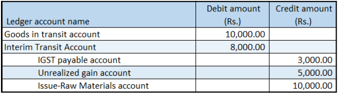
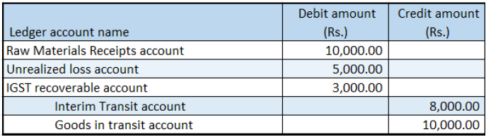

---
# required metadata

title: Indis GST Whitepaper
description:  This topic includes information about Indis GST Whitepaper in Microsoft Dynamics 365 for Finance and Operations.
author: EricWang
manager: RichardLuan
ms.date: 05/31/2019
ms.topic: article
ms.prod: 
ms.service: dynamics-365-applications
ms.technology: 

# optional metadata

# ms.search.form: 
audience: Application User
# ms.devlang: 
ms.reviewer: 
ms.search.scope: Core, Operations
# ms.tgt_pltfrm: 
# ms.custom: 
ms.search.region: India
# ms.search.industry: 
ms.author: EricWang
ms.search.validFrom: 2019-06-01
ms.dyn365.ops.version: 10.0.4

---

## Stock transfer order where there is tax on the transfer price

1. Click **Inventory management > Transfer order**.
2. Create a transfer order where the **Transfer type** field is set to **Stock transfer**.

Note: For the selected item, the item cost is 10,000.00, and the transfer price is 15,000.00

3. At the line level, click **Tax information from warehouse**
4. Click the **GST** tab
5. Click **OK**.
6. At the line level, click **Tax information to warehouse**.
7. Click the **GST** tab
8. Click **OK**.
9. Click **Inquiries > Tax document** to verify that the tax is calculated.

Example:

- Taxable value: 15,000.00
- IGST: 20 percent

10. Click Close

### Post the shipment

11. Click **Posting > Ship transfer order**.
12. Select the **Edit lines** check box.
13. In the **Update** field, select **All**.
14. Click **Setup > Tax document**
15. Click **Close**.
16. Click **OK**.

### Validate the voucher

17. Click **Inquiries > Transfer order history**.
18. Select the record where the Update type field is set to Shipment.
19. Click **Ledger > Voucher**.

Note: Tax accounts for the “from” warehouse GSTIN are posted.

### Post the receipt

20. Click **Posting > Receive**.
21. Select the **Edit lines** check box.
22. In the **Update** field, select **All**.
23. Click **Setup > Tax document**
24. Click **Close.**
25. Click **OK.**

### Validate the voucher

26. Click **Inquiries > Transfer order history**.
27. Select the record where the Update type field is set to Receive.
28. Click **Ledger > Voucher**

Note: Tax accounts for the “to” warehouse GSTIN are posted.