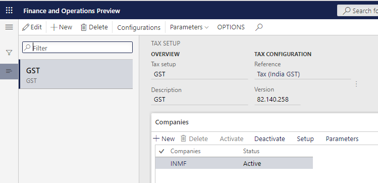
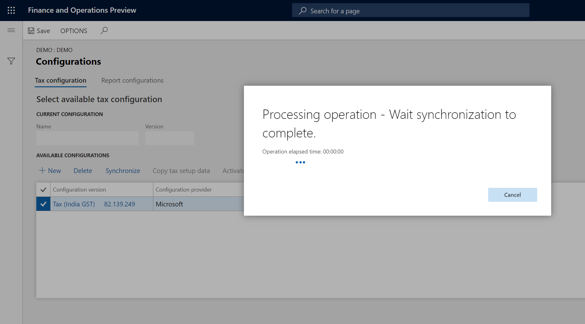
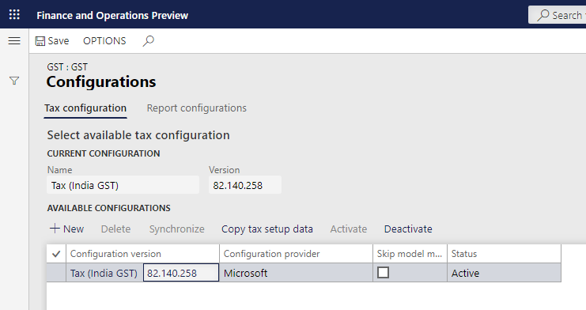
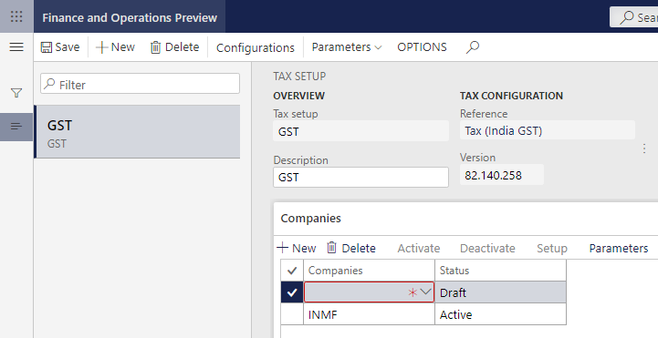
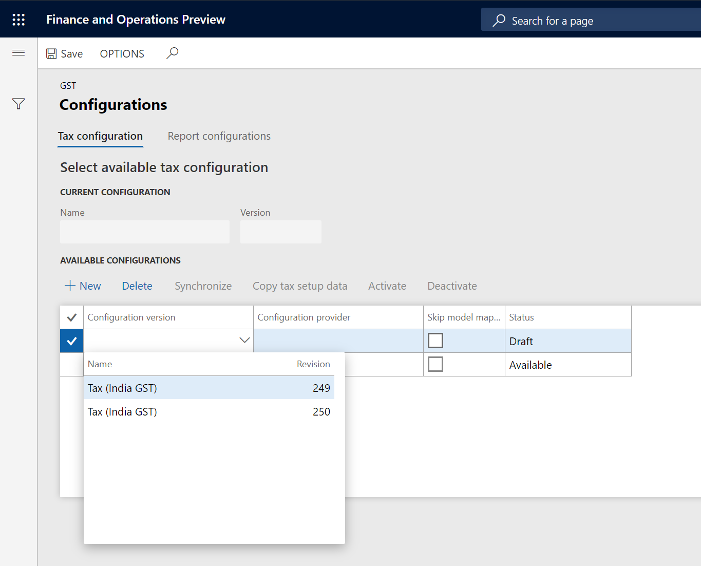

---
# required metadata

title: Define tax configuration and deploy it to legal entities
description:  This topic includes information about Indis GST Whitepaper in Microsoft Dynamics 365 for Finance and Operations.
author: EricWang
manager: RichardLuan
ms.date: 06/05/2019
ms.topic: article
ms.prod: 
ms.service: dynamics-365-applications
ms.technology: 

# optional metadata

# ms.search.form: 
audience: Application User
# ms.devlang: 
ms.reviewer: 
ms.search.scope: Core, Operations
# ms.tgt_pltfrm: 
# ms.custom: 
ms.search.region: India
# ms.search.industry: 
ms.author: EricWang
ms.search.validFrom: 2019-06-01
ms.dyn365.ops.version: 10.0.4

---

# Define tax configuration and deploy it to legal entities

### Create configuration version

1. Click **Tax > Setup > Tax Configuration > Tax Setup**
2. Click **New**
3. In the **Tax Setup** field, enter a value
4. In the **Description** field, enter a value
5. Click **Save**

6. Click **Configurations**
7. On the **Tax configuration** tab, under **Available configurations**, click New
8. In the **Configurations version** field, select a value
9. The new tax configuration is listed in the **Available configurations** grid

10. Click **Save**
11. Click **Synchronize**

12. Click **Activate**

Note: The activated configuration is updated as the current configuration
13. Click the **Report configurations** tab

Note: The Available configurations grid lists the configurations that are related to the report

14. Select the **Select** check box

15. In the **Report controller** field, select a value

16. **Save** and **Close**

17. On the **Companies** FastTab, create a record

18. In the **Companies** field, select a value

Note: one legal entity can only be assigned to one tax configuration

19. **Save** the record

20. Click **Activate** to activate the configuration for the company

### Update configuration version

21. Click **Deactivate**

22. Repeat steps 2 through 5 to load the latest configuration

23. Click **Configurations**

24. On the **Tax configuration** tab, under **Available configurations**, click New

25. In the **Configurations** field, select a value

The new tax configuration is listed in the Available configurations grid

26. Click **Save**
27. Select the record, and then click **Synchronize**
28. Click **Activate**

Note: The activated configuration is updated as the current configuration

29. **Save** and **Close**

