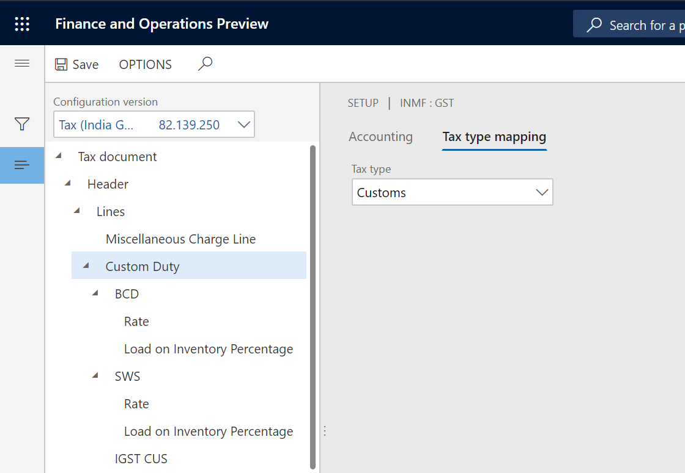
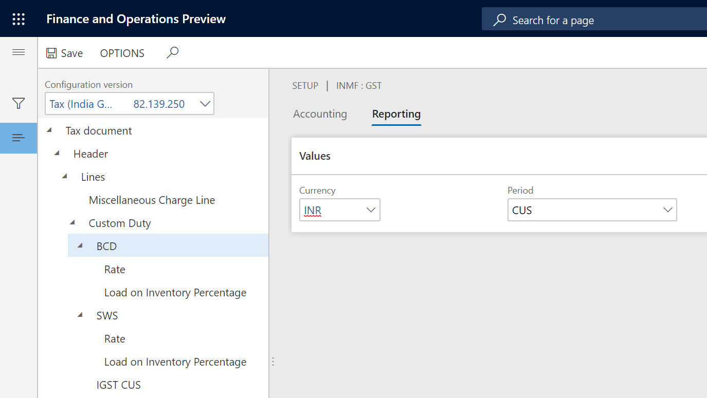
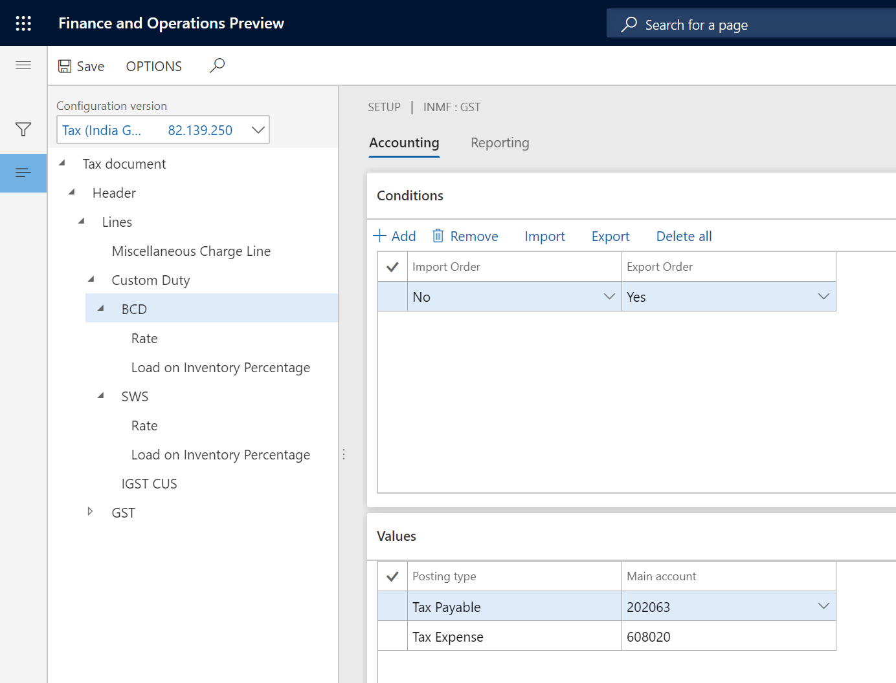
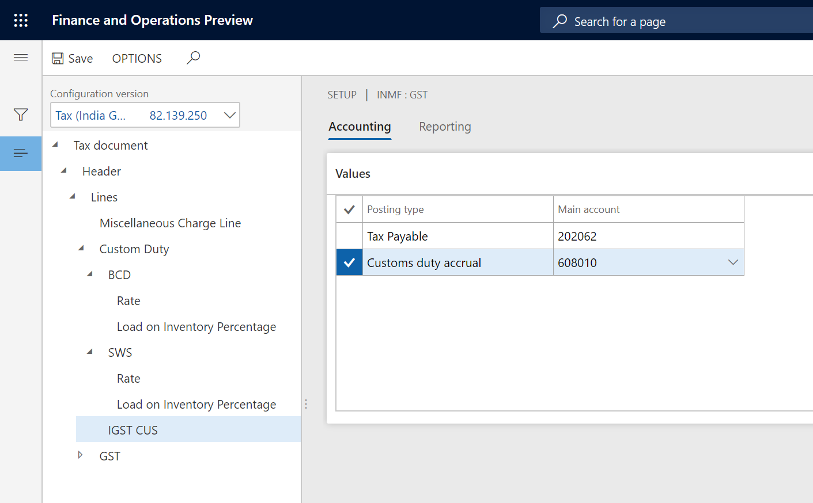
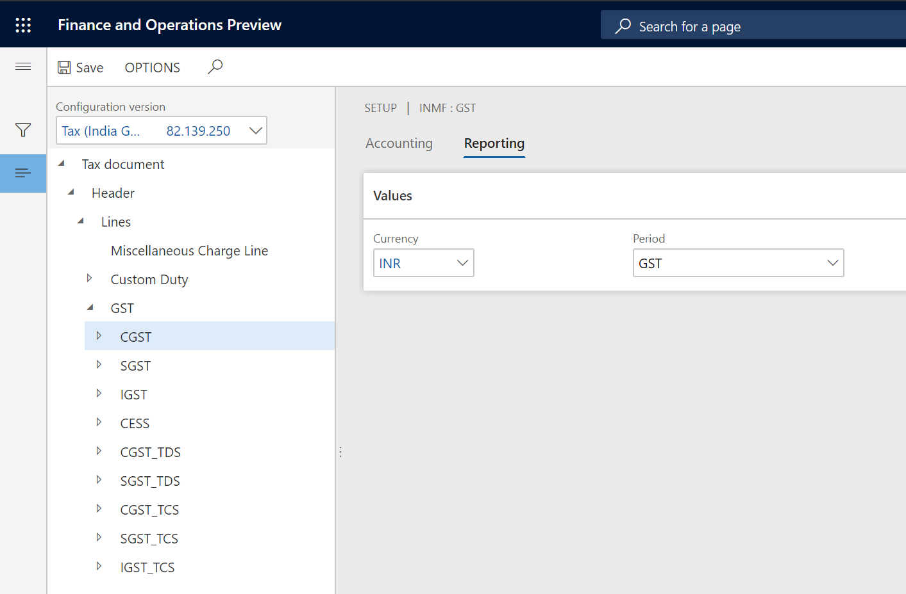
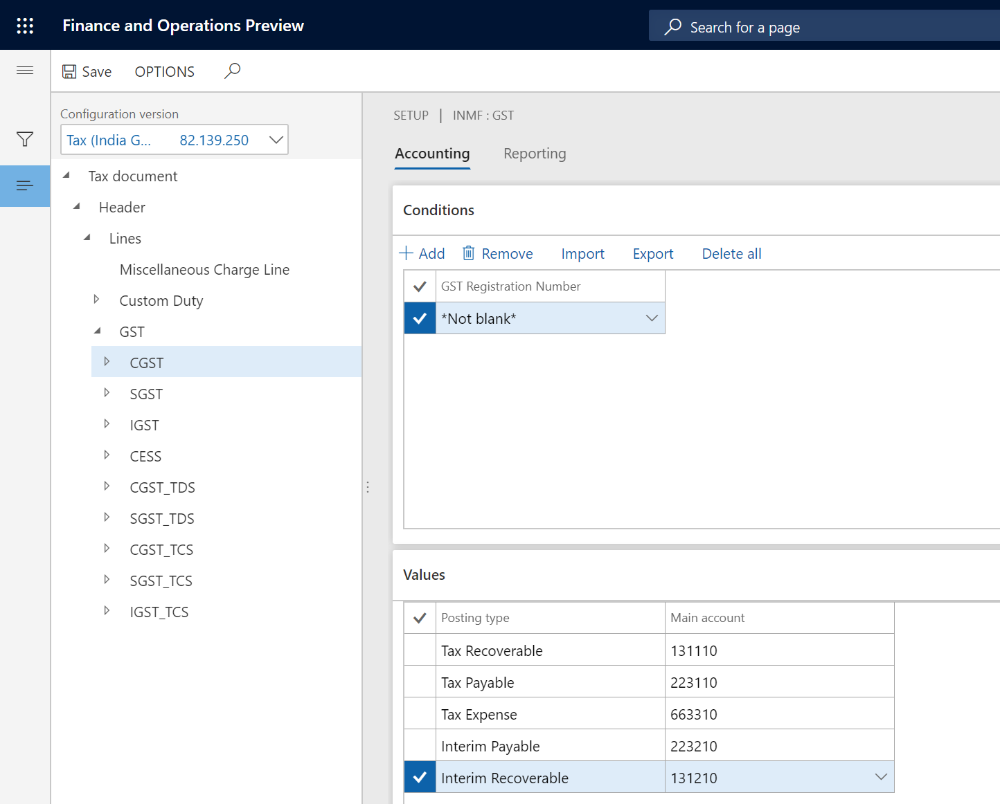

## Tax type - Customs

### Define tax type mapping

1. Click **Tax > Setup > Tax Configuration > Tax Setup**
2. Select a company
3. Click **Setup**
4. Select the **Customs** node
5. On the **Tax type mapping** tab, in the **Tax type** field, select **Customs**

### Define tax period

1. For each node for the tax component , on the **Reporting** tab, in the **Period** field, select a value

### Define main accounts

1. On the **Accounting** tab, on the **Conditions** FastTab, click **Add**
2. In the **Import Order** field, select a value
3. In the **Export order** field, select a value
4. **Save** the record
5. On the **Values** FastTab, in the **Main account** field, select a value

Note: The list of accounts is generated dynamically, based on the posting profile from the configuration. Selected Main account should be of posting type ‘Customs’.

6. Select **IGST CUS** node
7. On the **Values** FastTab, in the **Main account** field, select a value

Note: Main account selected for Customs duty accrual should be the same account selected for the Customs duty accrual account of the GST > IGST node

## Tax type - GST

### Define tax type mapping

1. Click **Tax > Setup > Tax Configuration > Tax Setup**
2. Select a company
3. Click **Setup**
4. Select the **GST** node
5. On the **Tax type mapping** tab, in the **Tax type** field, select GST

### Define tax period

1. For each node for the tax component, on the **Reporting** tab, in the **Period** field, select a value

### Define main accounts

1. On the **Accounting** tab, on the **Conditions** FastTab, click **Add**.
2. In the **GST Registration Number** field, select a value.
3. **Save** the record.
4. On the **Values** FastTab, in the **Main account** field, select a value.

Note: The list of accounts is generated dynamically, based on the posting profile from the configuration

Note: Tax main accounts can be defined at level of the tax type or the tax component. The value at the tax component level will override the value at the tax type level. If the field is left blank for a posting type at the tax component level, the corresponding value from the tax type level will be used for posting. We recommend that you set up the tax accounts at the tax component level per registration.

