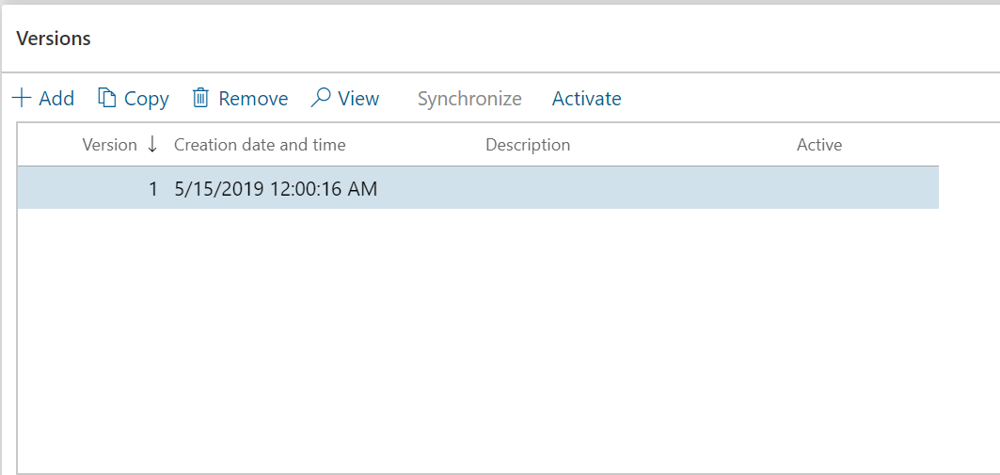
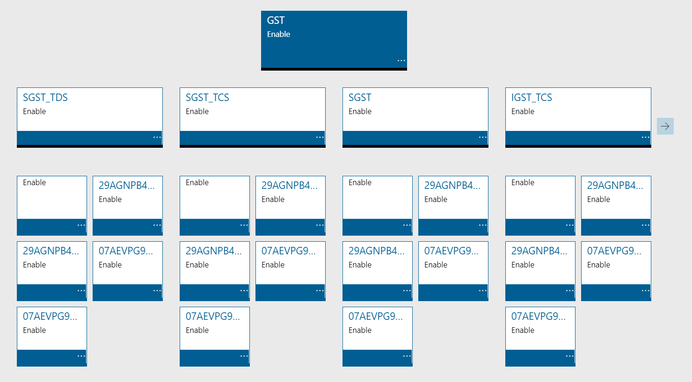
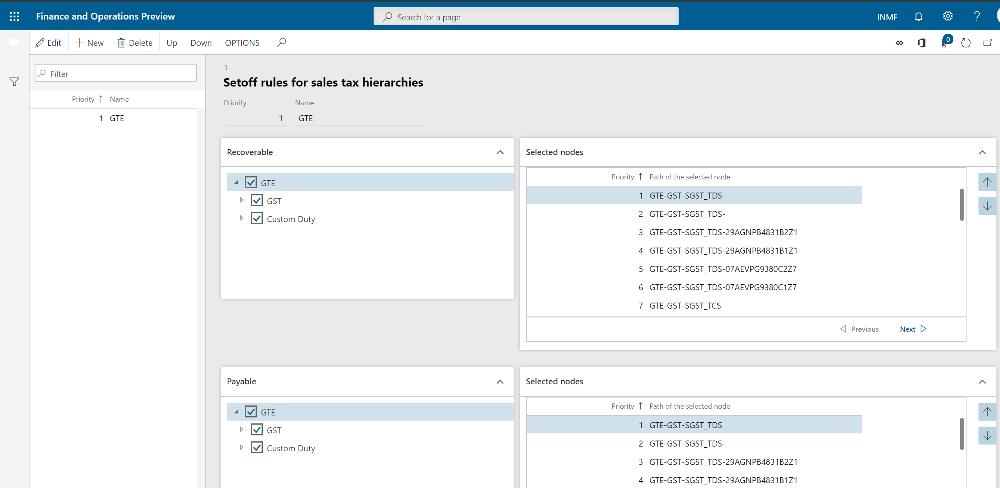
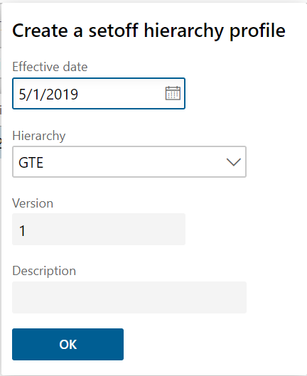
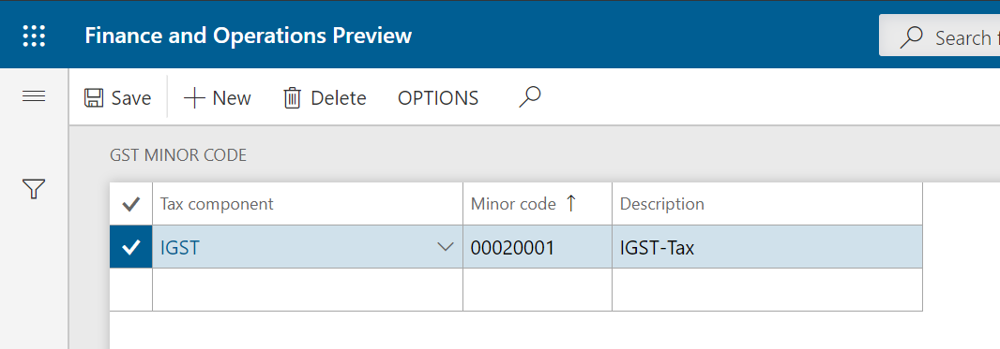

## Set up a sales tax hierarchy and setoff rules

1. Click **Tax > Setup > Sales tax > Sales tax hierarchies**
2. Click **New**
3. In the **Name** field, enter a value
4. In the **Structure** field, select **GTE hierarchy**

5. Click **OK**
6. On the **Versions** FastTab, click **Synchronize**
7. Close the message
8. Click **View**

The Sales tax hierarchy designer form shows the tax type and tax components per the configuration.

9. Click **Setoff rules for sales tax hierarchy**
10. Click **New**
11. In the **Name** field, enter a value
12. **Save** the record
13. On the **Recoverable** FastTab, select the tax components, and adjust the Priority values
14. On the **Payable** FastTab, select the tax components, and adjust the Priority values
15. Define the setoff rules per the legal requirement

16. **Save** and **Close**
17. **Close** the Sales tax hierarchy designer form
18. Click **Activate**
19. Click **Close**

## Maintain setoff hierarchy profiles

1. Click **Tax > Setup > Sales Tax > Maintain setoff hierarchy profiles**
2. Click **New**
3. In the **Effective date** field, enter a value
4. In the **Hierarchy** field, select a value

5. Click **OK**
6. Click **Activate**
7. Click **Yes**
8. Close the message
9. Close the form

## GST minor codes

1. Click **Tax > Setup > Sales tax > GST minor codes**
2. Click **New** to create a record
3. In the **Tax component** field, select a value
4. In the **Minor code** field, enter a value
5. In the **Description** field, enter a value
6. **Save** and **Close**

