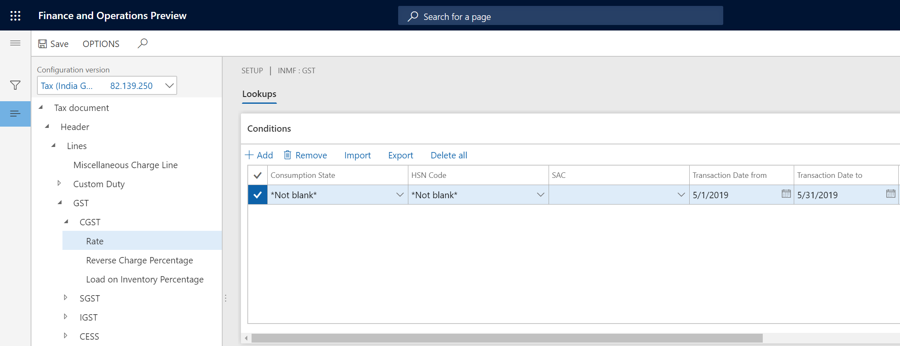
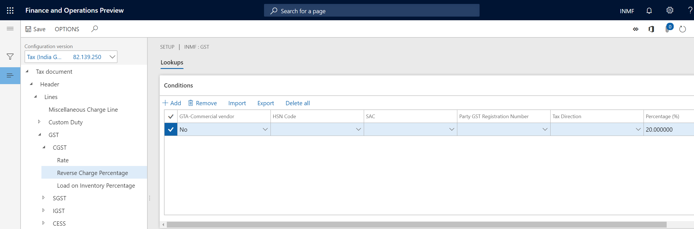
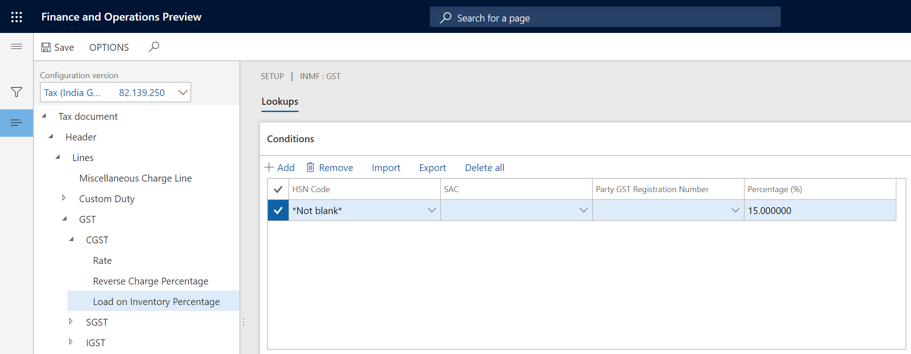
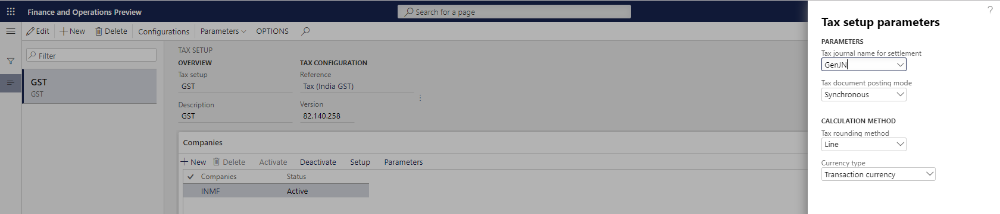

---
# required metadata

title: Set up rate and percentage tables
description:  This topic includes information about Indis GST Whitepaper in Microsoft Dynamics 365 for Finance and Operations.
author: EricWang
manager: RichardLuan
ms.date: 06/05/2019
ms.topic: article
ms.prod: 
ms.service: dynamics-365-applications
ms.technology: 

# optional metadata

# ms.search.form: 
audience: Application User
# ms.devlang: 
ms.reviewer: 
ms.search.scope: Core, Operations
# ms.tgt_pltfrm: 
# ms.custom: 
ms.search.region: India
# ms.search.industry: 
ms.author: EricWang
ms.search.validFrom: 2019-06-01
ms.dyn365.ops.version: 10.0.4

---

# Set up rate and percentage tables

1. Expand the node for the tax Component
2. Select the **Rate** node, and then, in the **Value** field, define the tax rates

3. Select the **Reverse Charge Percentage** node, and then, in the **Value** field, define the reverse charge percentage

4. Select the **Load on Inventory Percentage** node, and then, in the **Value** field, define the load on inventory percentage

5. **Save** and **Close**
6. On the **Companies** tab, Click **Parameters**

7. Enter values for these parameters
8. Click **OK**

