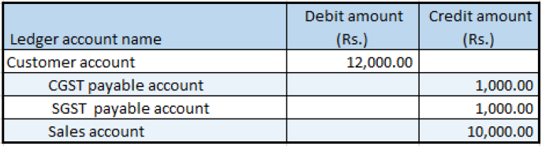

---
# required metadata

title: Indis GST Whitepaper
description:  This topic includes information about Indis GST Whitepaper in Microsoft Dynamics 365 for Finance and Operations.
author: EricWang
manager: RichardLuan
ms.date: 05/31/2019
ms.topic: article
ms.prod: 
ms.service: dynamics-365-applications
ms.technology: 

# optional metadata

# ms.search.form: 
audience: Application User
# ms.devlang: 
ms.reviewer: 
ms.search.scope: Core, Operations
# ms.tgt_pltfrm: 
# ms.custom: 
ms.search.region: India
# ms.search.industry: 
ms.author: EricWang
ms.search.validFrom: 2019-06-01
ms.dyn365.ops.version: 10.0.4

---

## Tax amount adjustment

1. Click **General ledger > Journals > General journal**.
2. Create a journal, and define a journal name.
3. Click **Lines**.
4. In the **Account type** field, select **Customer**.
5. In the **Account** field, select a value.
6. In the **Debit** field, enter a value.
7. In the **Offset account type** field, select Ledger.
8. In the **Offset account** field, select a value
9. Click **Tax information**
10. On the **GST** tab, in the **HSN code** field, select a value
11. Click the **Customer tax information** tab
12. Click **OK**.

### Validate the tax details

13. Click **Tax document**
14. On the **Adjustment** tab, in the **Tax amount (Adjusted)** field, modify the value to override the tax amount that the system calculates.
15. Click **Apply adjustment** to apply the new tax amount.
16. Click the **Tax details** tab

### Reset a tax adjustment

17. Click **Recalculate** to reset the taxes to the amounts that were originally calculated

## Adjust the tax applicability from interstate to intrastate

1. Select the **GST** node.
2. Click **Tax applicability** to override the tax applicability that the system determined.
3. Clear the **IGST** check box, and select the **CGST** and **SGST** check boxes
4. Click **OK**.
5. Click **Apply adjustment** to apply your changes
Note: Click Recalculate to reset the tax applicability to its original value.
6. Click **Post > Post**

### Validate the financial entries

7. Click **Inquiries > Voucher**.

Note: Tax adjustment functionality is available for purchase orders and sales orders at the invoicing stage