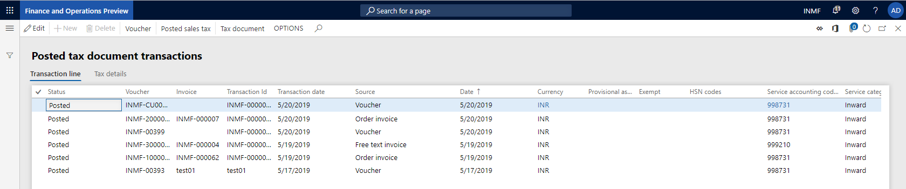
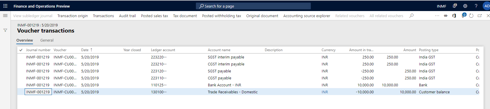
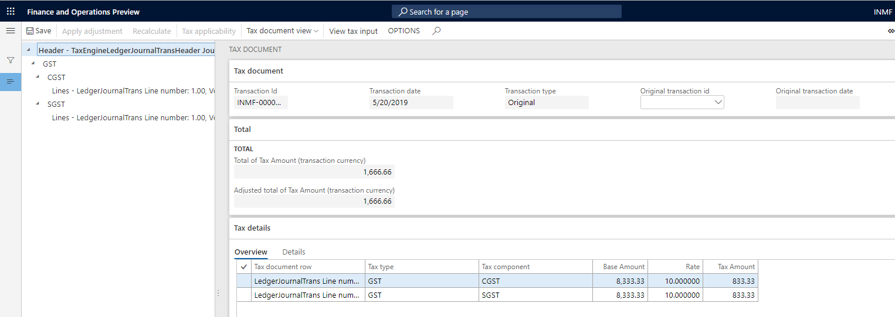
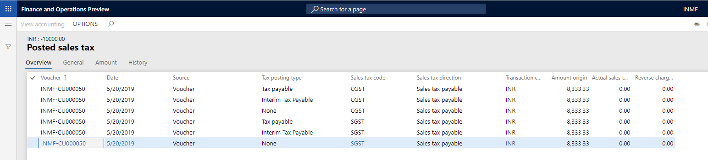

---
# required metadata

title: Indis GST Whitepaper
description:  This topic includes information about Indis GST Whitepaper in Microsoft Dynamics 365 for Finance and Operations.
author: EricWang
manager: RichardLuan
ms.date: 05/31/2019
ms.topic: article
ms.prod: 
ms.service: dynamics-365-applications
ms.technology: 

# optional metadata

# ms.search.form: 
audience: Application User
# ms.devlang: 
ms.reviewer: 
ms.search.scope: Core, Operations
# ms.tgt_pltfrm: 
# ms.custom: 
ms.search.region: India
# ms.search.industry: 
ms.author: EricWang
ms.search.validFrom: 2019-06-01
ms.dyn365.ops.version: 10.0.4

---

## Tax inquiry

1. Click **Tax > Inquiries and reports > Tax document transactions > Posted tax document transactions**.
2. Select the registration number
3. Click OK

4. Click Voucher to view the financial entry that is posted for the transaction

5. Click Close
6. Click Tax document to view the tax that is calculated on the transaction

7. Click Close.
8. Click Posted sales tax

9. Click Close.