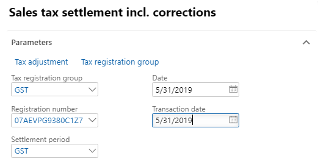
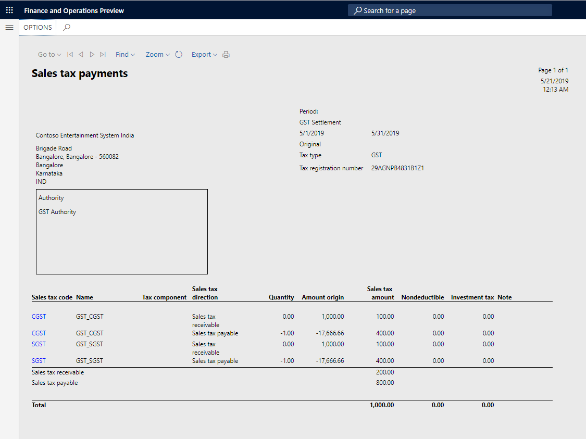

---
# required metadata

title: Rule-based tax settlement
description:  This topic includes information about Indis GST Whitepaper in Microsoft Dynamics 365 for Finance and Operations.
author: EricWang
manager: RichardLuan
ms.date: 06/05/2019
ms.topic: article
ms.prod: 
ms.service: dynamics-365-applications
ms.technology: 

# optional metadata

# ms.search.form: 
audience: Application User
# ms.devlang: 
ms.reviewer: 
ms.search.scope: Core, Operations
# ms.tgt_pltfrm: 
# ms.custom: 
ms.search.region: India
# ms.search.industry: 
ms.author: EricWang
ms.search.validFrom: 2019-06-01
ms.dyn365.ops.version: 10.0.4

---

# Rule-based tax settlement

1. Click **Tax > Declarations > Sales tax > Settle and post sales tax**.

2. Enter values

3. Click **OK**.

### Validate the tax settlement voucher entries

4. Click **Tax > Indirect taxes > Sales tax > Sales tax settlement periods**.
5. Select the settlement period, and then click **Sales tax payments**.
6. Verify that the settlement for the selected registration for the period is posted successfully.
7. Click **Print report**.

### GST authority payment

8. Click **Accounts payable > Payments > Payment journal**.
9. Create a journal.
10. Click **Lines**.
11. Create a journal voucher for Authority account.
12. Click **Settle transactions**.
13. Select the transaction
14. Click **Post > Post**.
15. Click **Inquiries > Voucher**

### Update challan information

16. Click **Functions > Challan information**.

## Manual adjustment of a tax settlement

1. Click **Tax > Declarations > Sales tax > Settle and post sales tax**.
2. Enter values
3. Click **Tax adjustment**

### Exclude transactions from the settlement

4. Expand the **GST** node.
5. Select the **CGST** node, and then click **Transaction**
6. Clear the selection of the transaction to exclude from the settlement.
7. Click **Update**.

Note: The tax setoff rule is recalculated, and the components are adjusted accordingly.

### Partial settlement of the transactions

8. Select the **SGST** node, and then click **Transaction**.
9. Select the transaction, and then update the **Recoverable amount to settle** field.
10. Click **Update**.

Notes:

- The tax setoff rule is recalculated, and the components are adjusted accordingly.
- Excess recoverable, unsettled transactions, and partially settled transactions should be part of the next settlement period.

11. Click **Close**.
12. Select the **Update** check box.
13. Click **OK**.
14. Close the report.

### Validate the tax settlement voucher entries

16. Click **Tax > Indirect taxes > Sales tax > Sales tax settlement periods**.
17. Select the settlement period, and then click **Sales tax payments**.
18. Verify that the settlement for the selected registration for the period is posted successfully
