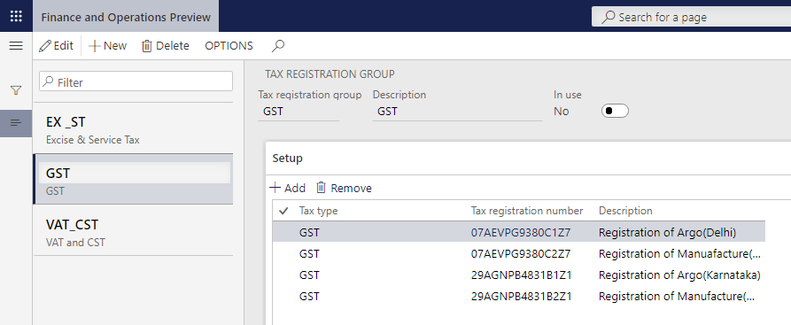

---
# required metadata

title: Attach the GSTIN to a tax registration group
description:  This topic provides information about how to attach the GSTIN to a tax registration group.
author: EricWang
manager: RichardLuan
ms.date: 06/04/2019
ms.topic: article
ms.prod: 
ms.service: dynamics-365-applications
ms.technology: 

# optional metadata

# ms.search.form: 
audience: Application User
# ms.devlang: 
ms.reviewer: kfend
ms.search.scope: Core, Operations
# ms.tgt_pltfrm: 
# ms.custom: 
ms.search.region: India
# ms.search.industry: 
ms.author: EricWang
ms.search.validFrom: 2019-06-01
ms.dyn365.ops.version: 10.0.4

---

# Attach the GSTIN to a tax registration group

To enable the India localization solution for GST in Microsoft Dynamics 365 for Finance and Operation, the following master data setup configurations are required:

- Define business vertical
- Update the state code and union territory
- Create a GSTIN master
- Define GSTIN numbers for the legal entity, warehouse, vendor, or customer masters
- HSN codes and Service accounting codes
- Create main accounts for the GST posting type
- Create a tax settlement period
- Attach the GSTIN to a tax registration group

To attach the GSTIN to a tax regisration group, click **Tax** \> **Setup** \> **Sales tax** \> **Tax registration group**, create a group, and define the required GSTIN.

