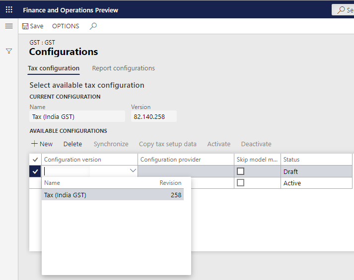

---
# required metadata

title: Define a tax configuration and deploy it to legal entities
description:  This topic provides information about how to define a tax configuration and then deploy it to one or more legal entities. 
author: EricWang
manager: RichardLuan
ms.date: 06/05/2019
ms.topic: article
ms.prod: 
ms.service: dynamics-365-applications
ms.technology: 

# optional metadata

# ms.search.form: 
audience: Application User
# ms.devlang: 
ms.reviewer: kfend
ms.search.scope: Core, Operations
# ms.tgt_pltfrm: 
# ms.custom: 
ms.search.region: India
# ms.search.industry: 
ms.author: EricWang
ms.search.validFrom: 2019-06-01
ms.dyn365.ops.version: 10.0.4

---

# Define a tax configuration and deploy it to legal entities

1. Click **Tax** \> **Setup** \> **Tax Configuration** \> **Tax Setup**.
2. Click **New**, and in the **Tax Setup** field, enter a value.
3. In the **Description** field, enter a value and then click **Save**.

4. Click **Configurations**, and on the **Tax configuration** tab, under **Available configurations**, click **New**.
5. In the **Configurations version** field, select a value. The new tax configuration is listed in the **Available configurations** grid.

6. Click **Save** and then click **Synchronize**.

7. Click **Activate**

> [!NOTE]
> The activated configuration is updated as the current configuration.

8. Click the **Report configurations** tab.

> [!NOTE]
> The **Available configurations** grid lists the configurations that are related to the report.

9. Mark the **Select** check box and in the **Report controller** field, select a value.

10. **Save** and **Close**

11. On the **Companies** FastTab, create a record, and in the **Companies** field, select a value.

> [!NOTE]
> Note: Only one legal entity can be assigned to one tax configuration.

12. **Save** the record.
13. Click **Activate** to activate the configuration for the company.

## Update the configuration version

1. Click **Deactivate**.
2. Click **Configurations**, and on the **Tax configuration** tab, under **Available configurations**, click **New**.
3. In the **Configurations** field, select a value. 

> [!NOTE]
> The new tax configuration is listed in the **Available configurations** grid.

4. Click **Save**
5. Select the record, and then click **Synchronize**.
6. Click **Activate**.

> [!NOTE]
> The activated configuration is updated as the current configuration.

7. Click **Save** and then click **Close**

