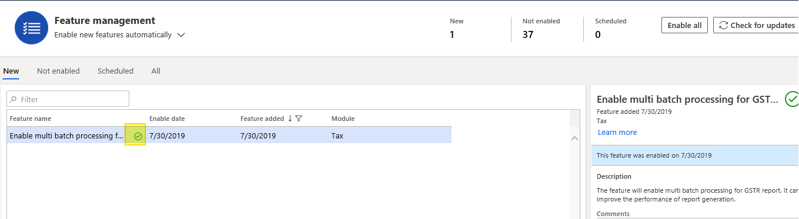
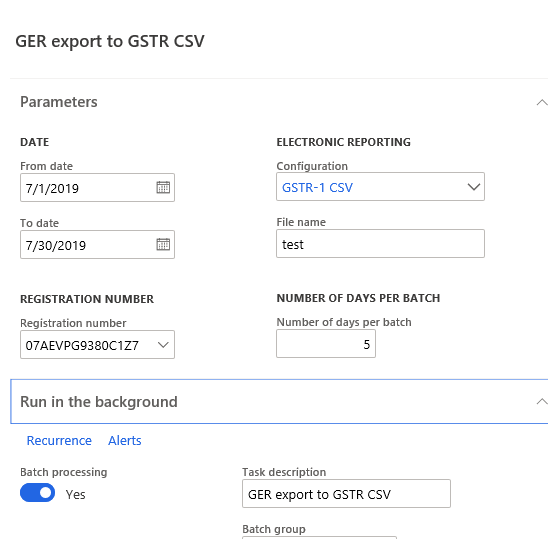

---
# required metadata

title: Enable multi batch processing for GSTR reports
description: This topic explains how to enable multiple batch processing for GSTR reports.
author: prabhatb
manager: RichardLuan
ms.date: 08/06/2019
ms.topic: article
ms.prod: 
ms.service: dynamics-365-applications
ms.technology: 

# optional metadata

# ms.search.form: 
audience: Application User
# ms.devlang: 
ms.reviewer: kfend
ms.search.scope: Core, Operations
# ms.tgt_pltfrm: 
# ms.custom: 
ms.search.region: India
# ms.search.industry: 
ms.author: prabhatb
ms.search.validFrom: 
ms.dyn365.ops.version: 10.0.6

---

# Enable Multi-batch processing for GSTR reports 

Many tasks in Finance and Operations can be run as part of batch jobs. Batch jobs are generally created for task like processing reports,coordinating schedule maintenance,and creating and sending document such as invoices. By using batch jobs, user can avoid slowing down his computer or the server during typical working hours. The tasks in a batch job can run either sequentially or at the same time .

In India GSTR returns are required to be filed by every legal entity and the volume of transactions are general very high as all the sales and purchase Invoice details are reported to the Government. Currently GSTR reports can be generated directly through report dialog box or through batch process. However report generation process some time takes a lot of time. To make this process more dynamic and efficient multi batch processing feature is provided  for GSTR reports .This will improve  performance of report generation significantly.

## Enable Multi-batch processing feature 
Go to **Work spaces**\>**Feature management**
Enable Multi-batch process feature 

## Generate GSTR report 

1. Go to **Tax**\>**Sales tax report**\>**GER export to GSTR CSV**.
2. Set **‘batch processing’** to **true**.
3. Set **‘number of days per batch’** greater than **0**.
4. Click **ok**.

## Get CSV files

1. Go to **Organization administration\>**Electronic reporting**\>**Electronic reporting job**.
2. **GER export** to **GSTR CSV_**_Merged** which is generated as a **merged file**

 
