---
# required metadata

title: GST project transactions
description:  
author: kfend
manager: AnnBe
ms.date: 07/02/2019
ms.topic: article
ms.prod: 
ms.service: dynamics-ax-applications
ms.technology: 

# optional metadata

#ms.search.form:
audience: IT Pro, Application User
# ms.devlang: 
ms.reviewer: kfend
# ms.suite: 
# ms.tgt_pltfrm: 
# ms.custom: 
ms.search.region: India
ms.search.scope: Core, Operations
# ms.search.industry: 
ms.author: ralin
ms.dyn365.ops.version: 7.3.1
ms.search.validFrom: 2019-7-02
---

# GST project transactions

[!include [banner](../includes/banner.md)]

## Project category
1. Go to **Project management and accounting** \> **Setup** \> **Categories** \> **Project categories.**
2. On the **Project** fast tab, in the **Service accounting code** field, select a value.
3. Click **Close**.

## Project through approved project quotation
1. Go to **Project management and accounting** \> **Quotations** \> **Project quotations**.
2. Create a project quotation.

    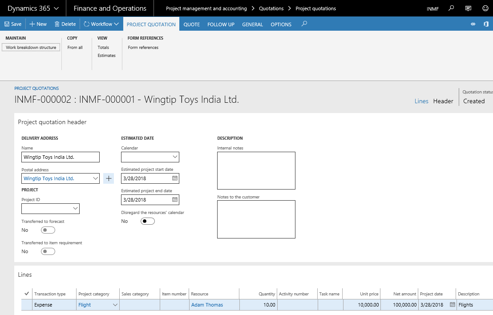

3. Select **Tax information**.

    

4. Click **OK**
5. On the Action Pane, on the **Quote** tab, in the **Tax** group, select **Tax
    document**.

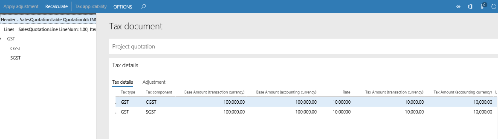

6. Close the form.
7. On the Action Pane, cick **Workflow** \> **Submit**, to start the quotation workflow.
8. Update the comment, and then select **Submit**.

### After the quotation is approved 
1. On the Action Pane, click **Quote** \> **Process** \> **Send quotation**.
2. Click **OK**.
3. On the Action Pane, click **Follow up** \> **Generate** \> **Confirm**.
4. Click **OK**.

## Create a project contract
1.  Go to **Project management and accounting** \> **Projects** \> **Project contracts**.
2.  Create a new project contract.
3.  On the Action Pane, on the **Project contract** tab, in the **Attachments** group, select **Tax information**.

    

## Create a project
1. On the Action Pane, on the **Maintain** tab, in the **New** group, click **Project**.
2. In the **Project type** field, select **Time and material**.
3. Enter a project name and select a project group.
4. Select the project contract ID and then select **Create project**.
5. On the Action Pane, on the **Project** tab, in the **Setup** group, click **Tax information**.

    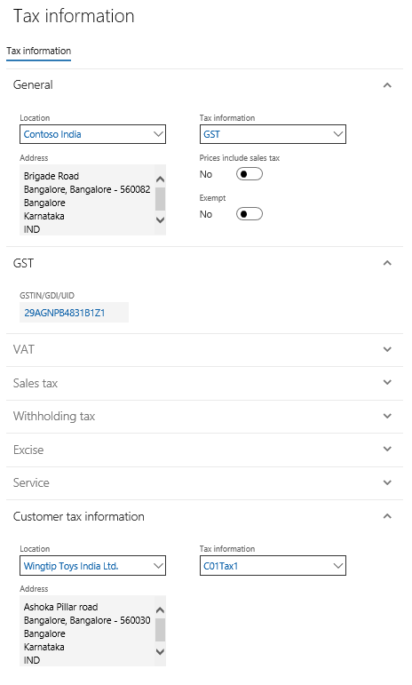

6. Click **OK**.

## Create an Expense journal
1. On the **Projects** page, on the Action Pane, on the **Project** tab, in the **Journals** group, click **Expense**.
2. Click **New** to create a new journal and then select **Lines** to create a project expense journal.

3. Click **General** tab.
4. Click **Invoice** tab and then enter the invoice information.
5. Select **Tax information** \> **Cost**.

    

6. Click **OK**, and then select **Tax information** \> **Invoice**.

    

7. Click **OK** and then click **Tax document**.

    

8. Close the form.
9. Click **Post** \> **Post**.
10. Select **Inquiries** \> **Voucher**.

| Ledger account name      | Debit amount (Rs.) | Credit amount (Rs.) |
|--------------------------|--------------------|---------------------|
| Purchases account        | 5,000.00           |                     |
| CGST recoverable account | 500                |                     |
| SGST recoverable account | 500                |                     |
| Vendor account           |                    | 6,000.00            |

11. Close the form.

## Create an Hour journal
1. On the **Projects** page, on the Action Pane, on the **Project** tab, in the **Journals** group, click
    **Hour**.
2. Click **New** to create a new journal, and then select **Lines.**
3. Create a project hour journal.

    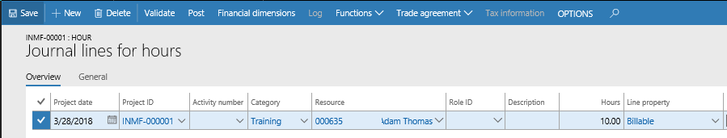

4. Select the **General** tab.

    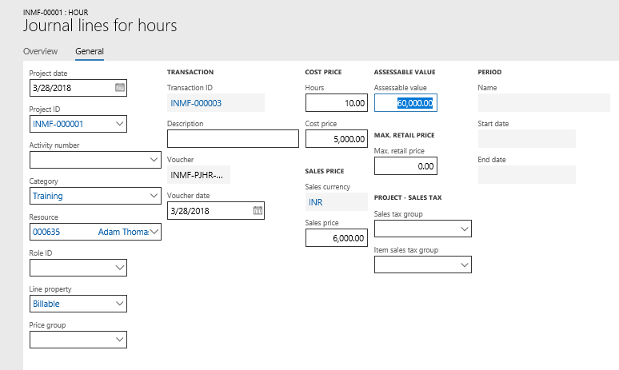

5. Save the record and then select **Tax information**.

    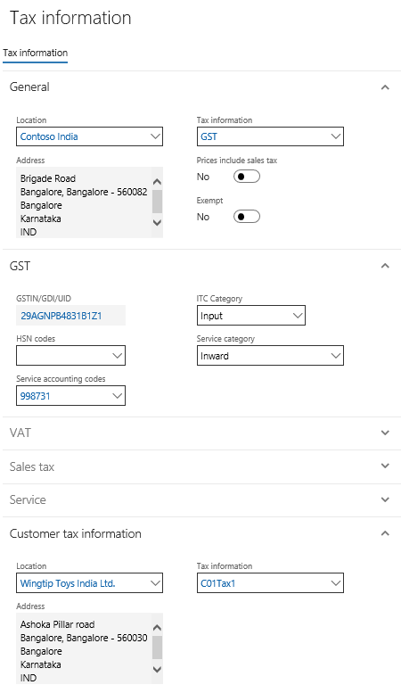

6. Click **OK**.
7. Click **Post**.
8. Click **OK** and then close the form.

## Create an Item journal
1. On the **Projects** page, on the Action Pane, on the **Project** tab, in the **Journals** group, click **Item**.
2. Click **New** to create a new journal, and then select **Lines**
3. Create an item journal.

    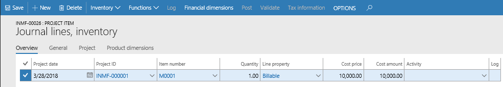

4. Select the **Project** tab.

    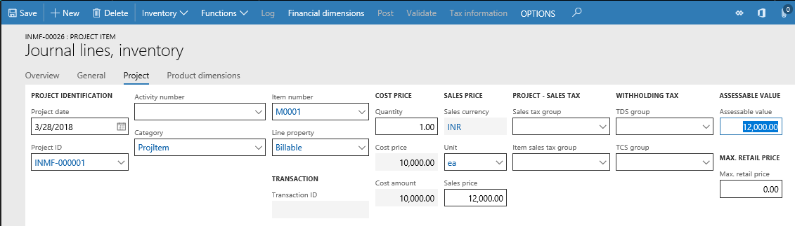

5. Save the record, and then select **Tax information**.

    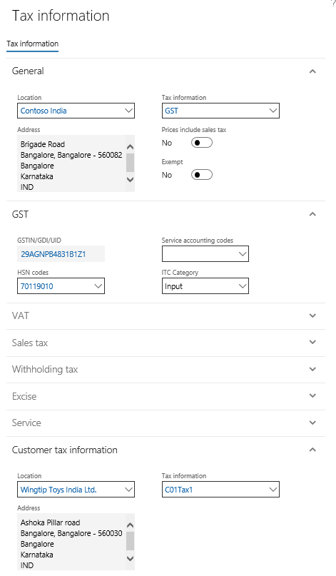

6. Click **OK**.
7. Click **Post**.
8. Click **OK**, and then close the form.

## Create a Fee journal
1. On the **Projects** page, on the Action Pane, on the **Project** tab, in the **Journals** group, click **Fee**.
2. Click **New** to create a new journal, and then select **Lines**.
3. Create a new journal line,and then select the **General** tab.

    

4. Select **Tax information**.

    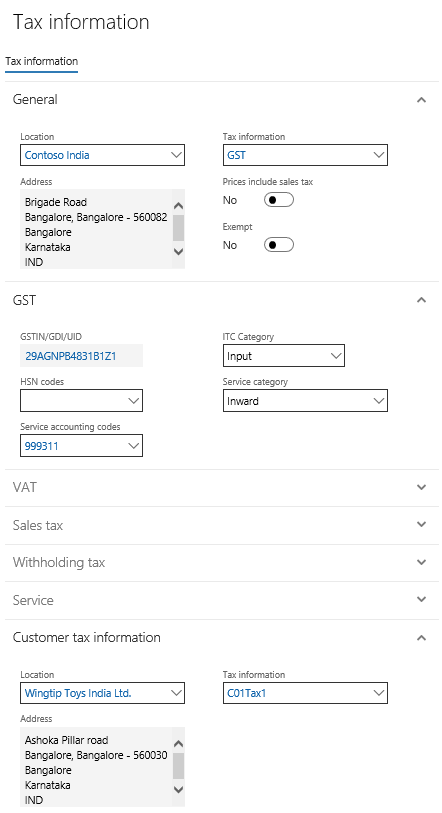

5. Click **OK**.
6. Click **Post**.
7. Click **OK**, and then close the form.

## Create an on-account transaction

1. On the **Projects** page, on the Action Pane, on the **Manage** tab, in the **Bill** group, click **On-account transactions**.
2. Click **New** and enter a sales price.

    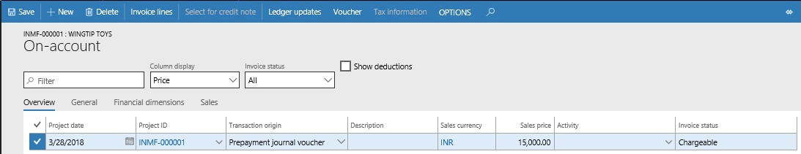

3. Select **Tax information** and then select the **GST** FastTab.
4. Select the SAC code.

    

5. Click **OK**, and then close the form.

## Create a project invoice proposal
1. On the **Projects** page, on the Action Pane, on the **Manage** tab, in the **New** group, click **Invoice proposal**.
2. Select the project transactions for invoicing and then click **OK**.
3. Select **View details**.
4. Click **Tax information**.

    

5. Click **OK**, and then close the form.
6. Click **Tax document**.

    

7. Close the form.

### Update additional fees
1. Click **Create Fees**.
2. Define the values and then click **OK**.
3. Select the **Fee** tab.
4. Select the additional fee record and then select **View details**.
5. Click **Tax information.**

    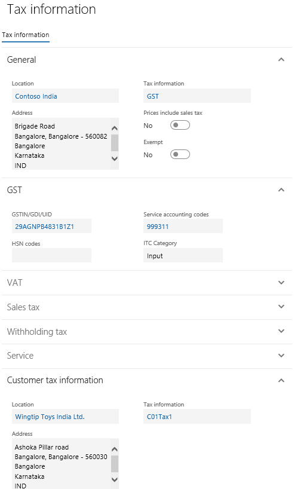

6. Click **OK**, and then close the form.
7. Click **Tax document**.

    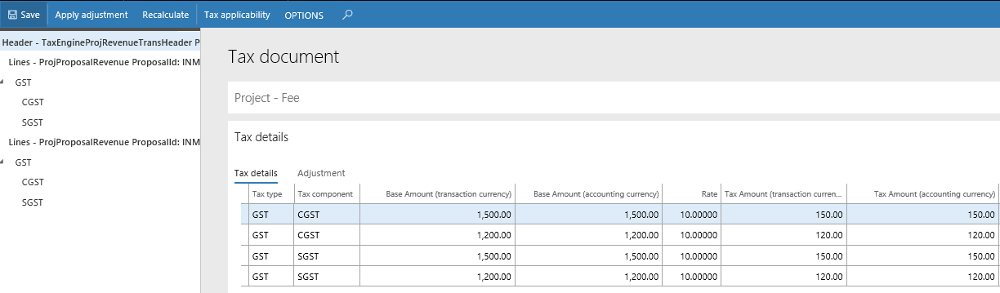

8. Close the form.
9. Click **Post**.
10. Click **OK**.
11. Click **OK**.

## Create a customer advance invoice
1. On the **Projects** page, on the Action Pane, go to the **Manage** tab, and in the **Bill** group, select **Customer advance** \> **Request a customer advance**.
2. Enter a description and the customer advance amount.
3. Click **OK**.
4. Click **View details**.
5. Click **Tax information.**
6. On the **GST** FastTab, select the SAC code.

    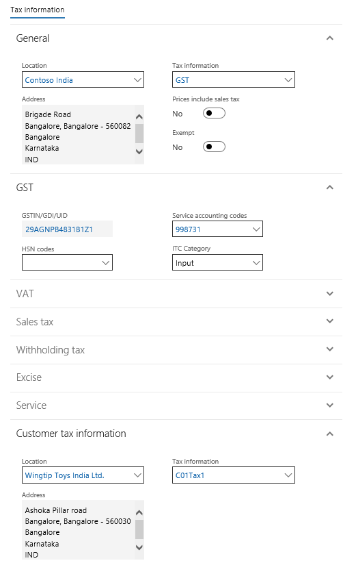

7. Click **OK**, and then close the form.
8. Click **Tax document** to validate the tax computation.
9. Close the form.
10. Click **Post**.
11. Select **Print invoice**, and then click **OK**.
12. Click **OK**.

## Validate the tax report

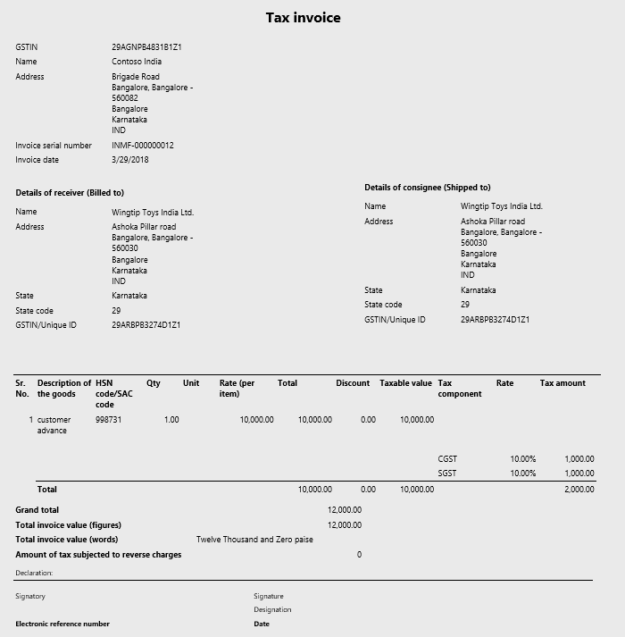

## Service management

1.  Go to **Service management** \> **Common** \> **Service agreements** \> **Service agreements**.
2.  Create a new service agreement.
3.  Select **Create service orders**.

    

4.  Click **OK**.

### Validate a service order

1.  On the Action Pane, on the **Deliver** tab, in the **Service order** group, click **View**.

    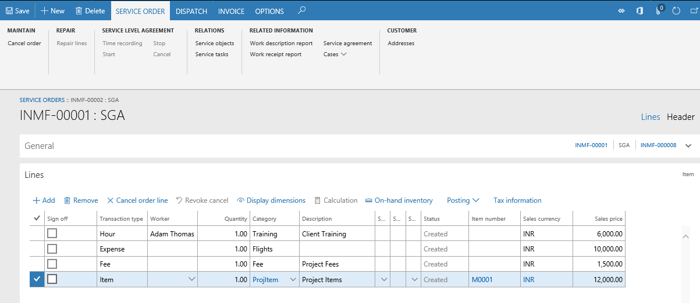

2.  Click **Edit**.
3.  On the Action Pane, on the **Service order** tab, in the **Show** group, switch to the header view.
4.  Mark the **Sign off** check box.
5.  On the Action Pane, on the **Dispatch** tab, in the **Service stage** group, click **Next stage**.
6.  On the Action Pane, on the **Invoice** tab, in the **Post** group, click **Service order**.

    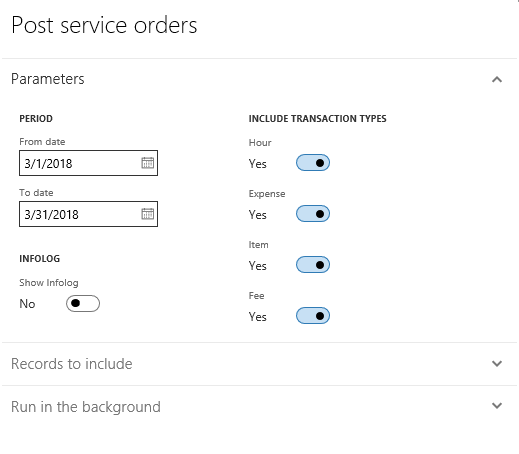

7.  Click **OK**.

## Create a project invoice proposal
1. On the Action Pane, on the **Invoice** tab, in the **Related information** group, click **Project invoice proposals**.
2.  Click **New** \> **Invoice proposal**.
3.  Select a project, and then click **Search.**
4.  Click **OK**.
5.  Click **Post**.
6.  Click **OK**.
7.  Click **OK**.
