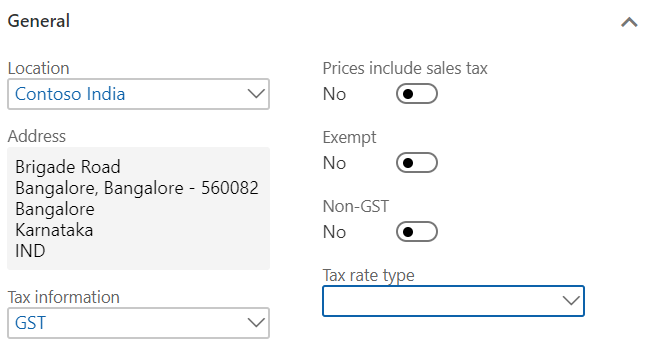
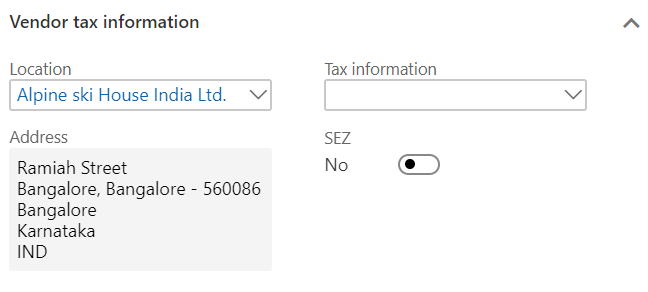
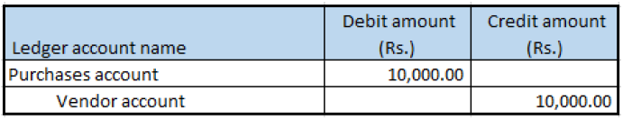

---
# required metadata

title: Purchase from a composite dealer
description:  This topic provides information about purchses from a composite dealer.
author: EricWang
manager: RichardLuan
ms.date: 06/04/2019
ms.topic: article
ms.prod: 
ms.service: dynamics-365-applications
ms.technology: 

# optional metadata

# ms.search.form: 
audience: Application User
# ms.devlang: 
ms.reviewer: kfend
ms.search.scope: Core, Operations
# ms.tgt_pltfrm: 
# ms.custom: 
ms.search.region: India
# ms.search.industry: 
ms.author: EricWang
ms.search.validFrom: 2019-06-01
ms.dyn365.ops.version: 10.0.4

---

# Purchase from a composite dealer

1. Click **Accounts payable** \> **Invoice** \> **Invoice journals**.
2. Create a journal and then click **Lines**.
3. Create a purchase transaction for a composite vendor and save the record.
4. Click **Tax information**.

   

5. On the **GST** tab, in the **HSN code** field, select a value.

   

6. Click the **Vendor tax information** tab and verify the information.

   

7. Click **OK**.

## Validate the tax details

1. Click **Tax document**.
2. Click Close.
3. Click **Post** \> **Post** to post the journal.
4. Close the message.

## Validate a voucher

To validate a voucher, click **Inquiries** \> **Voucher**.

