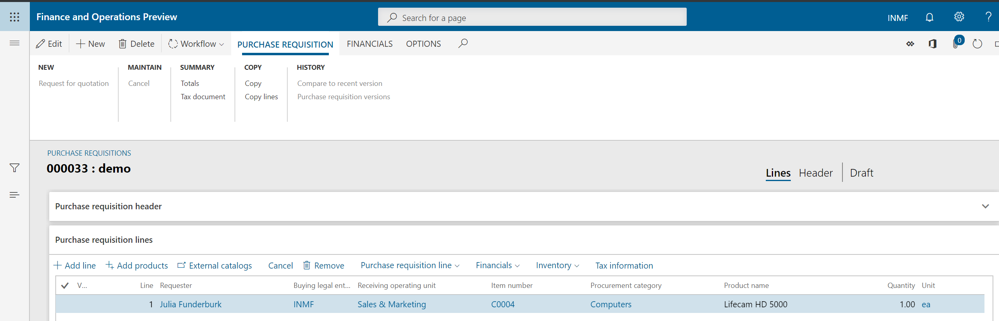
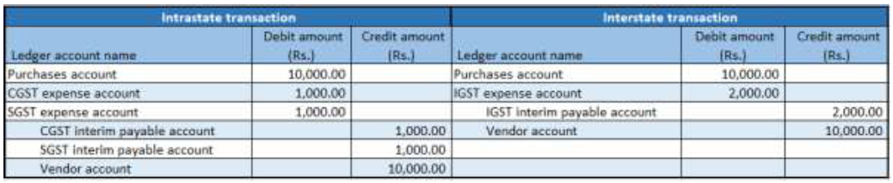
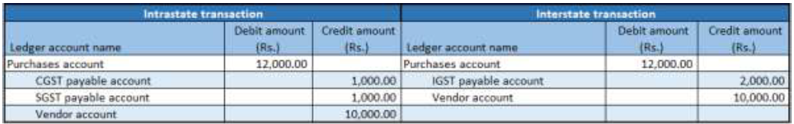

---
# required metadata

title: Purchases from an unregistered vendor
description:  This topic provides information about working with purchase requisitions for unregistered vendors.
author: EricWang
manager: RichardLuan
ms.date: 06/04/2019
ms.topic: article
ms.prod: 
ms.service: dynamics-365-applications
ms.technology: 

# optional metadata

# ms.search.form: 
audience: Application User
# ms.devlang: 
ms.reviewer: kfend
ms.search.scope: Core, Operations
# ms.tgt_pltfrm: 
# ms.custom: 
ms.search.region: India
# ms.search.industry: 
ms.author: EricWang
ms.search.validFrom: 2019-06-01
ms.dyn365.ops.version: 10.0.4

---

# Purchases from an unregistered vendor

## Create a purchase requisition
1. Click **Procurement and sourcing** \> **Purchase requisitions** \> **All purchase requisitions**
2. Create a purchase requisition for a taxable item and save the record. The **Tax information** button will be enabled.

   

3. Select **Tax information**, and on the **GST** tab, validate the default values for the following fields:

   - GSTIN/GDI/UID
   - HSN code
   - ITC category: Input
   - Service category: Inward

4. Select the **Vendor tax information** tab.

   > [!NOTE]
   > Because the **Tax information** field is blank for the vendor, the dealer is an unregistered dealer.

5. Click **OK**

   

6. On the **Action** Pane, on the **Purchase Requisition** tab, in the **Summary**, select **Tax document** to review the calculated taxes. For example, you might see:

   - Taxable value: 1,000.00
   - CGST: 5 percent
   - SGST: 10 percent

  

7. Click **Close**.
8. Click **Submit**.
9. Update the comment, and then click **Submit** to process the purchase requisition through a workflow.

## Approve the purchase requisition
1. Click **Procurement and sourcing** \> **Purchase requisitions** \> **Purchase requisitions prepared by me**.
2. Select the purchase requisition, and then click **Actions** \> **Approve**.
3. Update the comment, and then click **Approve**.

## Release the approved purchase requisition
1. Click **Procurement and sourcing** \> **Purchase requisitions** \> **Release approved purchase**
**requisition**.
2. Select the purchase requisition, and then select **New Purchase order**.
3. Close the message.

## Purchase order form

1. Click **Accounts payable** \> **Purchase orders** \> **All purchase orders**.
2. Select the purchase order, and on the **Purchase order lines** FastTab, click **Tax information**.
3. Click the **GST** tab.
4. Click the **Vendor tax information** tab.
5. Click **OK**.

## Validate the tax details

1. On the **Action** Pane, on the **Purchase** tab, in the **Tax group**, click **Tax document** to review the calculated taxes. For example, it might look like the following:

- Taxable value: 1,000.00
- CGST: 5 percent
- SGST: 10 percent

2. If you change any tax attributes after the order line is created, click **Recalculate** to recalculate the tax.
3. Click **Close**, and then click **Confirm**.

## Post the purchase invoice

1. On the Action Pane, on the **Invoice** tab, in the **Generate** group, click **Invoice**.
2. In the **Default quantity for lines** field, select **Ordered quantity**.
3. Enter the invoice number and on the **Action** Pane, on the **Vendor invoice** tab, in the **Actions** group, click **Post** \> **Post**.
5. On the Action Pane, on the **Invoice** tab, in the **Journals** group, click **Invoice**. 
6. On the **Overview** tab, click **Voucher**.

   - Financial entry for the purchase of goods
   
   

   > [!NOTE]
   > After the authority payment, the credit should be claimed.

   - Financial entry for the purchase of services
   
   

   - Financial entry on invoice payment

   

   > [!NOTE]
   > An appropriate Service accounting code must be selected.

   - Financial entry for the purchase of goods where the ITC category is set to Others

   

   - Financial entry for the purchase of services where the service category is set to Others

   

   - Financial entry on invoice payment

   

   - Financial entry for purchases where the load on inventory is set to 100 percent

   

